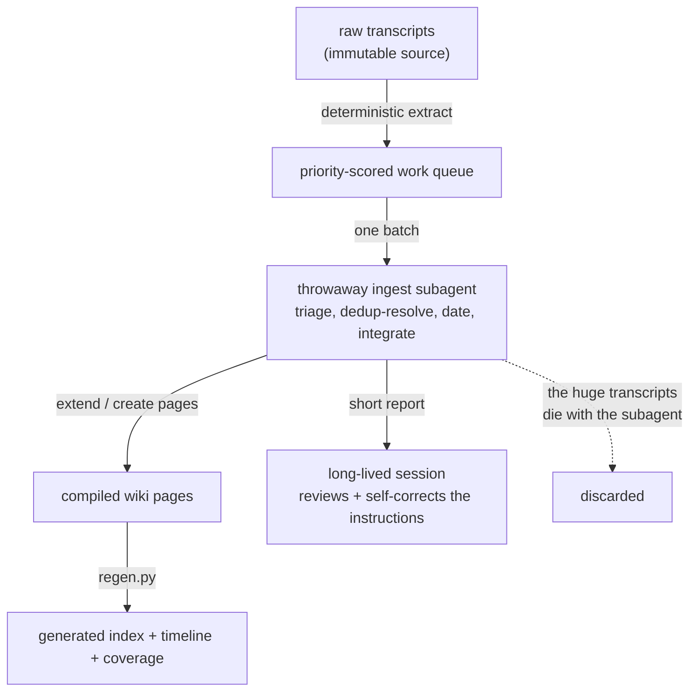

Years of raw chat logs are not a knowledge base. They are a pile of transcripts. Most of any chat history is task execution, dead ends, and one-off lookups, and the few real signals are buried in conversations that were about something else. Searching that pile per question is the RAG instinct, and it gives you fragments with no shared memory: the same fact stated five times across five sessions, a changed opinion sitting next to the opinion it replaced, no sense of when any of it was true.

The alternative is to treat knowledge as a compiled artifact. You build a separate, structured representation out of the transcripts once, deduplicated and interlinked and dated, and you query that. The transcripts are the source. The wiki is the build output. This is the shape of the life-wiki I run over my own chat history, and the idea I am writing about here is the system, not its contents.

The pattern is Andrej Karpathy's [LLM wiki](https://gist.github.com/karpathy/442a6bf555914893e9891c11519de94f) idea: have an LLM maintain a persistent wiki rather than retrieve from raw text each time. The credit for the idea is his. What is mine, and what this piece is about, is a working implementation: a self-ingest loop that compiles a real corpus into a regenerable markdown vault.

:::note{title="Mechanism only"}
Everything below is about the pipeline: how it ingests, dedups, links, and timestamps. The corpus it compiles is private and does not appear here. The point is that the system is describable entirely without its contents, which is itself part of the design. The mechanism is separable from the data.
:::

## Compiled, not retrieved

The distinction that makes this work is the same one between an interpreter and a compiler. RAG interprets: it goes back to the raw source on every query, re-reads the relevant chunks, and answers from them. Compiled knowledge does the expensive structuring work once, ahead of time, and produces an artifact that is already in the shape you want to query.

The compiled artifact here is a tree of plain markdown pages, one concept per page, grouped by type: chapters of time, durable beliefs, projects, people, recurring patterns, and so on. Each page is a synthesis, not a transcript. A belief page holds the stance and its verbatim supporting line, with a dated log of how the stance moved. A person page holds a relationship arc. The pages link to each other with wikilinks, so the artifact is a graph, not a folder of disconnected notes.

The important property is that the wiki is a **build output you can throw away and regenerate**. The raw logs are the source of truth; the wiki is derived from them by the ingest loop. If the schema changes or the compilation gets better, you can rebuild. That framing, source compiles to artifact, is what separates this from a document you hand-maintain forever and slowly let rot.

## The derived views are literally a build step

The clearest place to see "knowledge as a build output" is the layer of generated views. The wiki has two front doors, a by-type catalog and a chronological timeline, plus a coverage report. None of those are written by hand. A single script regenerates all three from the frontmatter of the pages.

```python title="tools/regen.py (the timeline pass)" {2,5-7}
eras = sorted([p for p in pages if p["type"] == "era"], key=...)
events = [p for p in pages if p["type"] == "event"]
for e in eras:
    # match each event to its era by link, then list it under that chapter
    evs = [ev for ev in events if e["link"] in ev["fm"].get("era", "")]
    ...
orphan = [ev for ev in events if ev["path"] not in matched]
```

The script reads every page, groups them by type, matches dated events to the time chapters they belong to, and writes the index, the timeline, and the coverage report. It runs at the end of every ingest batch. Because the views are regenerated from the pages, they cannot drift out of sync with the pages: there is no second copy to keep current. The catalog you read first when querying is, in the most literal sense, a compiler output. The orphan pass at the end matters too: any event that does not match a chapter is surfaced rather than silently dropped, so the build tells you where the structure is incomplete.

The coverage report is the same idea pointed at honesty. Every page carries a `coverage: rich | moderate | thin` field, and the regen pass rolls those up into a list of the thinly-sourced facets. The build output tells you where the knowledge base is blind. A corpus drawn from one channel over-represents whatever that channel was used for, and the generated coverage view makes that bias visible instead of hiding it behind a confident-looking wiki.

## Extraction is deterministic; compilation is the LLM's job

The first stage of the pipeline has no LLM in it at all. A plain Python extractor reads the export, follows each conversation's active branch to linearize it, writes one markdown file per conversation, and builds a work queue. It is fully local and deterministic, which matters because the corpus is sensitive and the raw layer should never depend on a model or a network call.

The extractor also does cheap, honest triage scoring so the loop can spend its budget well. It scores each conversation by how much the human actually wrote (a proxy for signal over lookup), with a bonus for first-person markers and a penalty for junk titles like "fix" or "install":

```python title="tools/extract_chatgpt.py (priority heuristic)" {3,6,9}
def priority(title, user_words, starred, body_lower):
    score = 0
    score += min(user_words / 8.0, 35)          # how much YOU wrote = signal
    if starred:
        score += 40
    if any(h in title.lower() for h in JUNK_TITLE_HINTS):
        score -= 25                              # "fix", "install", "convert"...
    if any(h in body_lower[:4000] for h in SIGNAL_TEXT_HINTS):
        score += 20                              # "i think", "my goal", "i decided"
    return round(max(score, 0), 1)
```

This is deliberately dumb. It is a heuristic to order the queue, not a judgment about meaning. The actual decision of what reveals something and what is just tooling is the LLM's, in the triage step of the ingest loop, where most conversations get skipped and a heavy one yields a handful of keepers. Splitting it this way keeps the irreversible, content-bearing work (the compilation) in the model and the mechanical, regenerable work (extraction, queueing, view generation) in deterministic code.

## Dedup is what keeps it from sprawling

A knowledge base built incrementally over thousands of independent sessions has one failure mode above all others: the same concept gets written down again and again, because no single session remembers the others. Left alone, you get five belief pages that are the same belief and a wiki that is just the transcript pile with extra steps.

The discipline that prevents this is **resolve before you write**. Every keyless page carries a short, stable canonical claim, and entities like people and projects carry aliases. On ingest, each new mention is searched against the existing pages and classified against each candidate's canonical claim as the same thing, a variant, or genuinely new:

- **Same**, with high confidence: load the existing page in full and extend it. Append a dated beat, bump the evidence count, add the source anchor. Extending beats forking.
- **New**, with high confidence: create a fresh page from a template.
- **Ambiguous**: do not guess. Write a row to a review queue and surface it for a human decision.

Creating a page whose name or canonical claim already resolves to an existing one is a lint failure, not a quiet duplicate. Merges are real, conservative, and logged, never done on low confidence, because a wrong merge destroys information and cannot be undone. This pre-write fetch-then-merge step is the single most load-bearing rule in the system. It is the difference between a knowledge base that converges as it grows and one that just accumulates.

## A knowledge base about a changing subject has to be time-aware

If the thing you are compiling changes over time, and a person's mind does, then timestamps are not metadata. They are content. The pipeline keeps two dates apart on purpose: when something was *said*, and when the content is *about*. They are usually not the same. A conversation reminiscing about an old chapter is recent in the log but belongs years back on the timeline. If you dated everything by the export timestamp, you would smear an entire history onto the handful of dates you happened to pull the data on.

So every kept item gets a content date with an explicit confidence level (exact, month, year, or inferred), and it is placed on the timeline by what it is about. Era boundaries are never hard-assigned silently; the loop proposes them and a human confirms. The timeline you read is then a real chronology of the subject, not a chronology of your export sessions.

The time-awareness shows up again in how the loop handles a contradiction. When new input disagrees with a page, the rule is to append a dated stance-log and flag it, not to overwrite. A changed mind is the content. Overwriting would erase the most interesting thing the corpus contains, which is the trajectory. A good knowledge base of an evolving subject is one that can show you the diff.

## The loop compiles itself, in a throwaway context

The ingest is recurring and runs as a loop, and its architecture is the same [bounded-context](/notes/context-engineering) shape as the rest of my agent systems. Raw conversations are huge, tens of thousands of tokens each, and reading them in the long-lived session would bloat it fast. So each fire of the loop spawns a throwaway subagent that does one batch in its own context, and the orchestrating session only reviews the result: did it commit, did the queue advance, did it extend rather than fork, did it tag sensitivity, did it avoid fabricating. The heavy reading happens in a context that is discarded; the orchestrator stays lean across an unbounded number of batches.



The loop is resumable by design. The work queue records what is done, so irregular runs are fine and nothing is ever re-ingested or double-counted. That overlaps directly with the throwaway-subagent and request-then-review patterns I describe in [bounded context, unbounded work](/notes/context-engineering), and it is one of the fleet members behind [my agent teams](/notes/my-agent-teams). The same orchestrate-then-delegate spine, pointed at a different surface: instead of building a feature or posting to an account, it is compiling a corpus into knowledge.

There is also a quieter self-improvement step. When a batch hits signal that no existing page type can hold, three times or more, the loop does not invent a new type. It writes a proposal and surfaces it for a human to approve before the schema changes. The content evolves automatically; the schema evolves only with a human in the loop. That keeps a vault coherent across hundreds of sessions instead of letting it drift into a hundred ad-hoc shapes.

## Why this framing matters

Calling knowledge a compiled artifact is not a metaphor for the sake of it. It changes what you are allowed to do. You can regenerate the wiki when the compiler improves. You can regenerate the derived views any time and trust they match the pages. You can reason about the corpus and the pipeline separately, which is exactly what lets me describe this whole system without ever showing what it compiled. The transcripts are the source. The knowledge is the build. And like any build, the interesting work is in the compiler, not the output.
