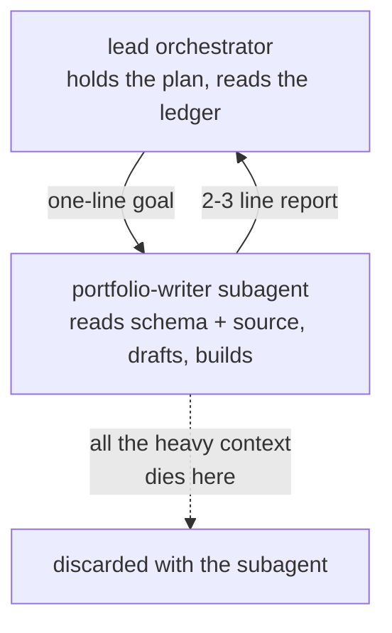

A single agent context that does everything has a predictable failure mode. It reads a hundred files, drives a form, builds the project, and somewhere in there it stops tracking the plan and starts skimming. The window did not run out of tokens. It ran out of attention. Every irrelevant detail it loaded to do the last step is still sitting in the context competing with the step it is on now. The model gets worse not because the task got harder but because the context got heavier.

The reflex is to reach for a bigger window. That does not fix it. A larger context that does everything is just a larger context that fills up, drifts, and degrades, only later. The real fix is structural: decide where the plan lives, and keep that place small. Everything heavy happens somewhere else, in a context you are willing to throw away.

This is the first move of [orchestrate, gate, ratchet](/notes/orchestrate-gate-ratchet), and it shows up identically in every agent system I run.

## The lead holds the plan and does no grunt work

The pattern is a split. A **long-lived orchestrator** holds the plan, decides what happens next, and delegates. A **fresh subagent** does one discrete unit of work and is discarded. The orchestrator never reads the hundred files itself, never drives the form itself, never runs the build itself. That work belongs in a disposable context so the lead's context stays lean and strategic.

The agent that maintains this site is written exactly that way. Its runbook says so in the first paragraph:

:::note{title="From this repo's own orchestrator runbook"}
The lead is long-lived: it holds the plan, decides when to run, delegates each discrete unit of work to a worker subagent, reviews the subagent's short report, and self-improves the system when a subagent falls short. The lead never does the scanning, writing, building, or deploying itself. That work belongs in disposable subagent contexts so the lead's context stays lean and strategic.
:::

That is not a slogan. The portfolio lead reads three small ledger files (the coverage index, the queue, the log), picks one article to write, and spawns a single `portfolio-writer` subagent with a one-line goal. The writer is the one that reads the schema, reads the source repos, drafts the article, runs the build, and checks itself against the honesty gate. All of that context (the source files, the draft iterations, the build output) lives and dies inside the writer. What comes back to the lead is a two or three line report: which article, the key takes, build pass or fail. The lead keeps the conclusion and discards everything that produced it.

You are reading the output of that loop right now. This article was written by a disposable writer the lead spawned for a single run.

## A subagent is bounded on purpose

The point of the subagent is not that it is smaller. It is that its context is **bounded and thrown away**. It gets exactly what it needs and nothing the lead is carrying.

Each worker in this fleet is a one-job agent pointed at one how-to. The portfolio's workers live in `.claude/agents/<name>.md` as short definitions, and each one says, in effect, read and follow `.claude/refs/<name>.md` exactly, do one unit of work, report, do not deploy. The definition carries the persona and a pointer; the ref carries the full procedure. The lead does not paste the procedure into the spawn. It hands the worker a high-level intent and lets the worker load its own how-to. So the writer never sees the deploy script, the video worker never sees the article schema, and none of them ever see the lead's running plan. The boundary is the design.

This is why a context that does everything is the wrong shape. The heavy work is not one thing, it is many unrelated things, and loading all of them into one window means each one is dragging the others down. Splitting them into bounded subagents means each job runs against a context that holds only that job.

The same split runs across the rest of the fleet, against very different surfaces:

- **The job-application agent** spawns one throwaway apply-subagent per application. Driving an ATS form is screenshot-heavy and chatty, so that context piles up fast. The orchestrator confirms the job, the subagent does the heavy form-driving for a single application, and the lead keeps a short report. One application per run, in a context that is thrown away. ([the full write-up](/notes/jobright-agent))
- **The X account agent** runs a lead that decides timing only, then delegates each post or reply to a fresh subagent that does the work in its own context. The lead never does the posting work itself, because that would bloat its context. ([the full write-up](/notes/x-agent))
- **The build team** is the same shape at a higher altitude. The lead conducts a PM, an engineer, and an independent verifier, and writes no code itself. When the engineer has to audit a hundred button handlers across an app, it does not read them all in one context. It fans the audit out to parallel subagents in small groups, precisely because a single agent fed all of them at once fills up and starts skimming. ([how the team works](/notes/my-agent-teams))

Different jobs, one rule: the context that holds the plan is never the context that does the grunt work.

## Context that does not return cannot rot the lead

Here is the property that makes this worth the trouble. The lead runs the writer loop every couple of days, indefinitely. If each run's context came back to the lead, the lead would accumulate every article it ever wrote, every source file it ever read, every build log, until it was the exact bloated everything-context the split was supposed to avoid. It does not, because each run's mess is quarantined in a subagent that is discarded. The lead's context after a hundred runs looks almost like its context after one: a few small ledger files and a short report.

That is the real reason to discard subagents rather than keep them warm. It is not about saving tokens on a single job. It is that **context which never returns to the orchestrator can never degrade the orchestrator.** The throwaway is the mechanism that lets a long-lived agent stay sharp across an unbounded number of jobs. Bounded context per job is what buys you unbounded work over time.

## The constraint that keeps it honest

There is one rule in this design that looks like a limitation and is actually load-bearing: **a worker subagent cannot spawn another subagent.** A subagent is a leaf. It cannot start its own subagents.

That sounds inconvenient. What happens when the article writer decides the piece would be stronger with a walkthrough video, which is its own heavy, context-eating job? It cannot spawn a video worker, because it is itself a subagent. So it does not try. It writes a small request (a row in a video queue, or a flag in its report) and stops. The long-lived lead, which can spawn, reads that request later and spawns the dedicated video worker to fulfill it.

:::tip{title="Request, do not spawn"}
A worker that wants heavy follow-on work does not spawn it. It requests it. The worker writes a small spec and reports; the lead, the only long-lived context that can spawn, fulfills it with a fresh dedicated worker. The no-nested-spawn rule is what forces this, and forcing it is what keeps the hierarchy flat: one orchestrator, many disposable leaves, no tangle of agents spawning agents spawning agents.
:::

Without that constraint, a deep job could grow a tree of subagents inside subagents, and the whole point (one small context holding the plan, everything else disposable) would quietly dissolve. With it, the shape stays flat and legible: a single orchestrator that holds the plan, and a flat layer of throwaway workers underneath it that each do one thing and vanish.

## The takeaway

Context engineering is mostly a placement decision. Not "how big is the window" but "what is allowed to accumulate where." Put the plan in a long-lived context and keep that context small. Put the grunt work in subagents that are bounded by design and thrown away when they finish. Let workers request heavy follow-on work rather than spawn it, so the hierarchy stays flat. Do that and a single orchestrator can run real, unsupervised work for as long as you let it, because the only context that has to last is the one you kept empty enough to last.
