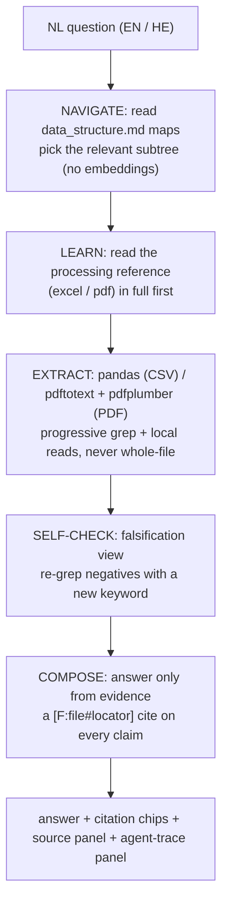

A client posted a job for an AI business knowledge assistant and spent half the description saying what they did not want. The line that mattered: "I am NOT looking for someone who simply uploads PDFs into a vector database and performs semantic search." They wanted query routing, hybrid retrieval, grounded generation, and source attribution you can trace. So I built it. Then I built it again, a completely different way, to see which retrieval engine actually held up. Same product both times. The only thing that changed was how the answer gets retrieved.

The two builds live in separate repos: `Contract-Retriever-RAG` (v1) and `Contract-Retriever-Agentic` (v2). Same data, same golden questions, same citation UX. This is the story of swapping the engine under a working product and what that swap cost.

## The product (held fixed across both)

A free-form business question comes in. The answer comes back grounded: every factual claim carries an inline citation you can click to a SQLite row or a PDF page. If the data does not contain what you asked, the system says so and cites the absence instead of inventing a clause. Two domains in the data share no key (a school's vendor contracts and an unrelated family-court case file), and the system never fabricates a join between them.

The example questions from the job brief set the bar. "What contracts expire in the next 90 days and what penalties are defined in those contracts?" is a trap: the contracts data has expiry dates but no penalty column. The honest answer lists the expiring contracts with citations and states plainly that penalty terms are not in the available sources. That discipline (answer what you can, refuse what you cannot, never paper over the gap) is the whole product. The retrieval engine is just how you get there.

## v1: a router plus hybrid SQL and RAG

The first build is a Next.js app on DeepSeek. The flow:

```
question -> ROUTER (DeepSeek, reports its choice) -> SQL retrieval + RAG retrieval
        -> grounded generation (cite every claim) -> validateAnswer() -> cited answer + source panel
```

The router is a real LLM call that returns structured JSON naming which source(s) it picked, and the UI shows that choice. "What contracts expire in 90 days" routes to SQL; "what did the court decide" routes to RAG; a question spanning both composes from both. The structured side is a bundled read-only SQLite, built deterministically from the source CSVs. The document side is an in-app vector index over PDF chunks, using a local `multilingual-e5-small` model so there is no embeddings key and the architecture is already multilingual for the Hebrew requirement.

The trust property is a pure function called `validateAnswer()`. Generation is told to answer only from the supplied evidence and to attach a citation token to every claim. Then `validateAnswer()` checks that each token resolves to a real piece of evidence retrieved this turn, and rejects any answer that makes an uncited factual claim. Because it is pure and deterministic, a unit test pins it: it must pass every golden example and fail every toy. "Fluent but ungrounded" becomes a red result instead of a shipped lie.

:::note{title="What the two stores deliberately do NOT share"}
The CSV-to-SQLite store and the PDF vector index have no join key. A vendor-contract row and the family-court PDF are unrelated, so multi-source answers are composed and cited separately, never merged on an invented join. This rule survives unchanged into v2.
:::

This build works and is deployed. It satisfies the brief on its own terms: routing, hybrid retrieval, grounding, attribution, an extensible source layer. But it leans on a vector index, and I wanted to know what the product looked like with the thing the client was most allergic to removed entirely.

## v2: an agent that navigates and reads the real files

The second build keeps the product and throws out the engine. No router. No SQLite. No embeddings at all. Instead a Python FastAPI backend runs a Claude Agent SDK loop over the real `knowledge/` tree.

The index is a set of `data_structure.md` maps, one per directory, written for a human to read. The root map names the two domains and states they share no join key. The agent reads that map, picks the relevant subtree, descends into that directory's map, and decides which files to open. The maps are the index and the honesty guardrail in the same file: the rules about the missing penalty column, the absent payment-status field, and the no-join boundary live in the maps the agent reads before it touches data.



The agent's tools are `Read`, `Glob`, `Grep`, and `Bash`. It reads a processing reference before it touches a file, extracts CSVs with pandas and PDFs with `pdftotext`/`pdfplumber`, and works progressively (grep, then local reads around the hits) rather than dumping whole files into context. Before it answers it runs a falsification self-check: it re-reads its own conclusions asking "could this be wrong," re-greps each "not available" with a different keyword, and combines separately-found evidence so a refusal is a probed conclusion, not a first guess.

Every factual claim gets a `[F:<file>#<locator>]` token. The locator grammar is exact and resolve-or-fail: a PDF page is `#p<printed-page-N>` bounds-checked against the document's printed page labels, and a CSV row is `#row=<Vendor>|<EndDate>` because the Contract ID column turned out to hold job titles and could not be the key. The system prompt is blunt about one trap in particular: compute figures from the actual data file and cite that file, never quote a number from a map as if the map were the source.

:::tip{title="Why no embeddings is a feature here"}
The client rejected vanilla vector search, so the agent reads the real files and shows its work. The trace records every map it read and every file it opened, which is both the product's "show me why" panel and the test harness's hook for "did it open the right file."
:::

## The part that actually changed: how you verify it

Swapping the engine quietly broke the test strategy, and that was the most interesting cost.

In v1, `validateAnswer()` is a pure, deterministic gate. You can unit-test it to death because the same input always produces the same output. In v2 the retriever is an agent, and an agent is non-deterministic. The same question can take a slightly different path on two runs. The deterministic gate does not transfer.

So the bar changes shape. Acceptance in v2 is a golden eval set run through several independent checks:

- **Deterministic answer-assertions**, which are still pure and run every time: the required figures are present, every citation resolves to a real file and page or row, a forbidden-token list stays absent, the honest refusal fires when the concept is missing, and a known conflict gets surfaced rather than silently resolved.
- **Trace inspection**: the harness asserts the agent opened the right file and did not open the wrong one. Because the SDK's tool-use stream is captured into a structured trace, "it read `contracts.csv` and never touched the family-court PDF" is a checkable fact.
- **Repeated-N runs**, where flaky equals fail. A non-deterministic system that passes once and fails once has not passed.
- **An LLM judge** for the prose layer, which the deterministic assertions cannot grade.

This is consciously a statistical guarantee rather than a provably deterministic one. I accepted that at design time. You make up for the loss of a single hard gate with breadth (several independent checks) and repetition (N runs), and you keep it honest by having an independent verifier run it, not the agent that wrote the code.

## Same product, swapped engine: what I took away

Two retrieval philosophies, one product, side by side. v1 routes and retrieves through a deterministic pipeline you can pin with a unit test. v2 lets an agent navigate human-readable maps and read the real files, trading the hard gate for a visible trace and a statistical bar. Neither is strictly "better." The deterministic pipeline is cheaper to verify and more predictable; the agentic one shows its reasoning, needs no vector store, and extends by dropping a new directory with a new map into the tree. The honesty contract (cite everything, refuse honestly, never fabricate a join) is identical in both, which is the point: the contract is the product, and the engine is an implementation detail you are allowed to change your mind about.
