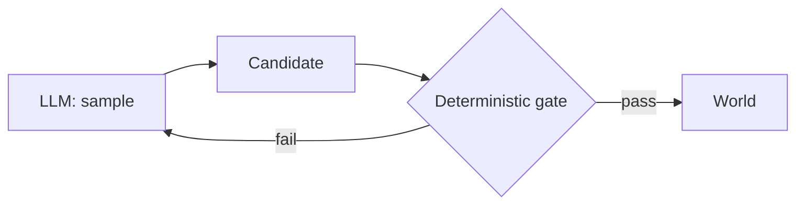

The model is the stochastic part. Everything I build around it exists to make the system as a whole behave, because the model on its own will not.

An LLM call is a sample from a probability distribution. Run the same prompt twice and you can get a clean answer once and a confident, plausible, wrong one the next time. Temperature, a reworded sentence, a slightly different context window: any of it moves the dice. So the mistake isn't that the model is sometimes wrong. The mistake is treating one good run as evidence the next run will be good too. Every agent I run unsupervised is built on the opposite assumption: I never trust a single generation, I gate it.

This is the second of the three moves in [Orchestrate, Gate, Ratchet](/notes/orchestrate-gate-ratchet). Here I want to stay on the gate, because it's the part that decides whether an agent is something you can leave running or a demo you have to babysit.

## The shape: stochastic in, deterministic out

The pattern is the same everywhere. A stochastic step produces a candidate. A deterministic check sits between that candidate and the world. The check is code, not a prompt, so it returns the same verdict every time on the same input. The model proposes; the deterministic layer decides.



The reason it has to be code is that you cannot fix non-determinism with more non-determinism. Asking a second model "is this output good?" just stacks another distribution on the first. A regex either matches or it doesn't. A unit test is red or green. A pure function returns the same boolean for the same input forever. That repeatability is the entire value: it converts "the model usually gets this right" into "this specific bad shape cannot get through."

## Four real gates

These aren't hypothetical. They're the actual checks running in front of the model across my build team and the rest of the fleet.

### The content-fidelity gate: `validateX()`

My build team's engineer has a rule for any feature that generates content a human will read. A "did the handler run" test is not enough, because a handler that writes "Please clarify" into an RFI or a placeholder into an email body runs fine. So the build encodes the acceptance bar as a pure function and pins it with a unit test that "passes every golden example and fails every toy example."

```ts title="rfi-validation.ts"
// Structural, domain-specific, deterministic. No model in the loop.
// Must cite a real reference, fields present and specific,
// phrasing not generic (stop-list). Same input, same verdict.
export function validateRfi(rfi: Rfi): Result { /* ... */ }
```

The point isn't the rules. It's that "real, not toy" stops being a judgment call and becomes a red test. The model can generate whatever it wants; if it generates a plausible placeholder, `validateRfi` rejects it at the door, every time, identically.

### The removable-handler proof

A test that's green proves the assertions you wrote currently pass. It does not prove the feature works. The way you tell a real test from theater is to break the thing it's supposed to be testing and watch what happens. My verifier's Gate 1 is exactly this: the journey test is valid only if it's removable-handler-proof. Break the handler, and the test must go red. If you can delete the feature's core logic and the test stays green, the test is decoration. (The article on [independent verification](/notes/independent-verification) walks through the production bug that taught me this: a "Send to Client" button whose entire handler was `setStatus("sent")`, green test suite, no email ever sent.)

This is determinism applied to the gate itself. A test only counts as a deterministic check if you've proven it discriminates. An assertion that passes whether the feature works or not is just a more expensive way of trusting the run.

### The voice gate: rules as data

x-agent posts to a real account on its own. Before any text can be sent, it goes through `tweet_composer.py`, which is not a generator. It's a validator that exits 1 the moment it finds an AI shape-tell, with every rule encoded as data so it bites instead of describing itself.

```python title="tweet_composer.py"
# Em dash: literal, en dash used as one, or spaced double-hyphen.
EM_DASH = [
    ("em dash (—)", re.compile(r"—")),
    ("en dash as em dash (–)", re.compile(r"–")),
    ("spaced double-hyphen ( -- )", re.compile(r"\s--\s")),
]
```

A model asked to "write in a human voice" will comply on average and slip on the tail. A regex for an em dash does not have an average. It catches the em dash on run one and run one thousand. The same script has a `--selftest` mode: a set of known-bad fixtures that must each fail and golden replies that must each pass. So the gate is itself gated. If a future edit breaks the rule that catches a tell, the selftest goes red before the gate ships.

### The fail-closed scanner

The hardest case is the one where the check can't tell. x-agent's `privacy_scan.py` stands between a private knowledge base and a public post, blocking the mechanical leaks: a real name, a dollar amount, a date, a private-tier source. The candidate-pool mode is default-deny: a page is shareable only if it's positively safe, and "merely not blocked" counts as not shareable.

The part I care about most is what it does when its own rules fail to load.

:::warning{title="Empty does not mean safe"}
If the protective name set loads empty while the knowledge base is non-empty, the scanner exits 2 (config error), not 0. An empty rule set means the loader is mis-pointed, not that there's nothing to protect. So it fails closed.
:::

This is the line that separates a real gate from a comforting one. A gate that passes when it can't tell is worse than no gate, because it manufactures confidence. The same instinct lives in my verifier: if a tool needed to confirm a real effect is missing, it flags "couldn't verify X" and never fakes a pass. "I couldn't check" and "it's fine" are different sentences, and a fail-closed system never collapses the first into the second.

## Why this is the load-bearing idea

Determinism around stochasticity doesn't make the model reliable. Nothing makes the model reliable; it's a distribution. What it does is make the *system* reliable around an unreliable component, the way a type checker makes a codebase safe without making any single programmer infallible.

It also changes what you fix when something slips through. If a bad output got past a gate, the output is not the interesting failure. The gate is. A green check that let a real miss through has a blind spot, so you strengthen the check, not just the instance. That's the [ratchet](/notes/the-ratchet), and it only works because the gates are deterministic in the first place: you can't tighten a check whose verdict was never reproducible.

So the order I build in is fixed. Identify the stochastic step. Decide the one shape that must never escape it. Write a check that's code, prove the check bites, make it fail closed. Then, and only then, let the model run unattended. The LLM proposes. The deterministic layer disposes.
