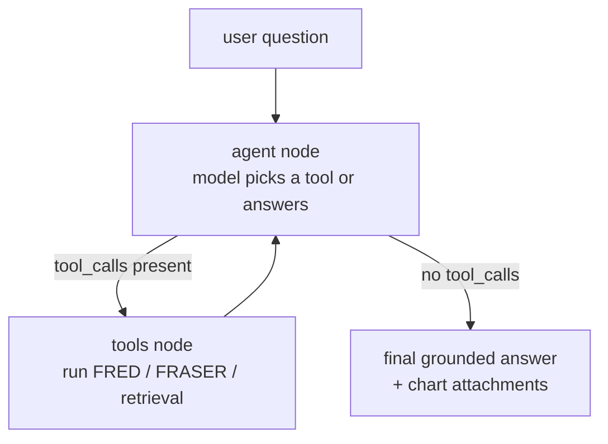

I wanted an economics assistant that could not bluff. Ask it about the latest CPI print or where the 10-year Treasury yield sits, and it should pull the actual number from the Federal Reserve's data service, not recite a figure from training data that might be a year stale. EconoRAG is that assistant: a LangGraph agent whose whole job is to refuse to answer until it has fetched real evidence.

It is two repos. `my-langgraph-rag` is the backend, a LangGraph retrieval agent adapted from LangChain's retrieval-agent-template, customized into a tool-using economics agent. `econorag-frontend` is a Next.js chat client that talks to it. This is the project that came before the FredGPT team practicum, same domain (FRED economic data), built solo as a way to learn the patterns that the later work leaned on.

## The one rule that shapes everything

The response system prompt is blunt about a single constraint:

```text title="prompts.py (response system prompt)"
You are an economics assistant who reasons step-by-step. Before giving a
final answer in this turn, you must have at least one tool result (from a
FRED tool or the retrieval tool) that provides evidence. If you have not
used a tool yet, do so now instead of replying. Only answer when the
information you cite comes from the latest tool outputs or retrieved
documents; do not rely on general world knowledge.
```

That last clause is the design. A normal chatbot will happily tell you the unemployment rate from memory. This one is told, in writing, that its own knowledge does not count: if no tool has run, it must run one before it speaks, and if every tool comes back empty it has to say it could not find the answer and stop. No speculation, no fabricated tool output. The grounding is not a nice-to-have bolted on after generation; it is the entry condition for being allowed to respond at all.

## A ReAct loop, not a fixed pipeline

The graph is small and it loops. There are two real nodes, `agent` and `tools`, wired so the model decides what it needs, the graph runs it, and control comes back to the model with the results.



The routing is one function: if the model's last message carried tool calls, go run them, otherwise the turn is done.

```python title="graph.py" {3-5}
def should_continue(state: State) -> str:
    """Route based on whether the last AI message requested tool usage."""
    last = state.messages[-1]
    if isinstance(last, AIMessage) and getattr(last, "tool_calls", None):
        return "tools"
    return "__end__"
```

A loop like this can spiral, so there is a hard ceiling. The tools node tracks `tool_call_count` and stops dispatching once it hits `MAX_TOOL_CALLS = 4`, returning a message that tells the model to answer with what it has already gathered. The agent gets to be adaptive, and the cap keeps a bad run from calling FRED in circles.

:::note{title="Why a cap, not just a good prompt"}
A prompt can ask the model to be efficient. A counter in state guarantees it. The four-call limit is a deterministic backstop around a stochastic decision-maker, the same instinct as a timeout or a retry limit anywhere else.
:::

## The economics tools are real API calls

The agent is bound to seven tools, and the interesting ones are not generic retrieval. They are concrete calls against the St. Louis Fed's FRED service and a FRASER-derived index:

- **`fred_chart(series_id)`** pulls the official `fredgraph.png` for a series straight from FRED, so the chart is the Fed's own rendering rather than something I redrew with matplotlib.
- **`fred_recent_data(series_id)`** fetches the latest datapoints plus the series title, units, frequency, and the official series notes, so the model reasons over the same caveats a careful analyst would read.
- **`fred_series_release_schedule(series_id)`** resolves a series to its release and returns the upcoming publication dates, which is how you answer "when does the next jobs report come out."
- **`fred_release_structure(release_name)`** looks up a release by name (say H.4.1, the Fed balance-sheet release) and returns its metadata and table structure.
- **`fred_search_series(query)`** searches the FRED catalog when the user does not already know the exact series ID.
- **`fraser_search_fomc_titles(query)`** is a fuzzy title search over an FOMC catalog indexed into Postgres, ordered by trigram similarity, that hands back the PDF URLs for historical meeting documents.
- **`retrieve_documents(query)`** is the vector-store retrieval for anything outside the FRED API.

Each tool returns a structured payload with a human-readable `message` and the data, and every one of them catches its own errors and returns a friendly note instead of crashing the conversation. A missing series ID comes back as "a FRED series_id is required," not a stack trace, so one bad tool call does not kill the turn.

## Charts go around the model, not through it

A base64-encoded PNG is thousands of tokens of noise to a language model. Feeding the chart image back into the prompt on the next turn would be expensive and pointless, but the browser still needs that image. So the graph splits the channels.

When the chart tool runs, the image lands in a separate `attachments` field in graph state, with its own reducer, and it is explicitly described as out-of-band:

```python title="state.py"
attachments: Annotated[list[dict[str, Any]], add_attachments] = field(
    default_factory=list
)
"""Out-of-band payloads (e.g., chart images) returned to clients
without entering the LLM prompt."""
```

The FastAPI server reads `attachments` off the final state and returns it next to the text answer, so the frontend renders the chart in a `<figure>` while the model's context stays lean. Numeric datapoints get the same treatment through a `series_data` channel: the model sees a compact JSON block to reason over, and the client gets the structured points. The model handles meaning; the image and the raw data take the side door.

## Each user only sees their own documents

The retrieval side supports Elasticsearch, Pinecone, and MongoDB as the vector store, and in every case the search is scoped to the requesting user. The retriever appends a `user_id` filter to the query before it runs:

```python title="retrieval.py" {2-3}
search_filter = search_kwargs.setdefault("filter", [])
search_filter.append({"term": {"metadata.user_id": configuration.user_id}})
```

The FastAPI layer verifies a Supabase JWT, pulls the user's ID, and threads it into the graph config as `configurable.user_id`. So data isolation is enforced where the query is built, not left to convention. In local development the auth check falls back to an anonymous user so you can run the whole thing without Supabase keys, which kept the iteration loop fast.

Series metadata gets into the index through a separate ingestion script that chunks FRED series descriptions and writes them to the search backend, deliberately leaving the long series notes out of the keyword index to keep it lean. There is also a smoke-test script that hits live FRED and runs a single message through the graph, a quick "is the wiring still good" check that runs outside CI.

## Where it ran and what it led to

The backend is containerized and deployed on Fly.io as a LangGraph server, with the Next.js frontend on top calling a single `POST /ask` endpoint that carries the message plus the prior conversation for context. Nothing exotic, which was the point: a small, honest agent you could actually stand up.

The thing I took from EconoRAG is that grounding works best as a precondition, not a postprocess. "You may not answer without a tool result" is a one-sentence rule, but it turns a confident guesser into a system that fetches the real number or admits it does not have one. That same discipline, answer from the data or say you could not find it, carried straight into the [FredGPT](/work/fredgpt) practicum that followed, and it is the same instinct behind the [Contract-Retriever rebuild](/notes/contract-retriever): the retrieval engine is an implementation detail, but the contract that every claim is grounded is the product.
