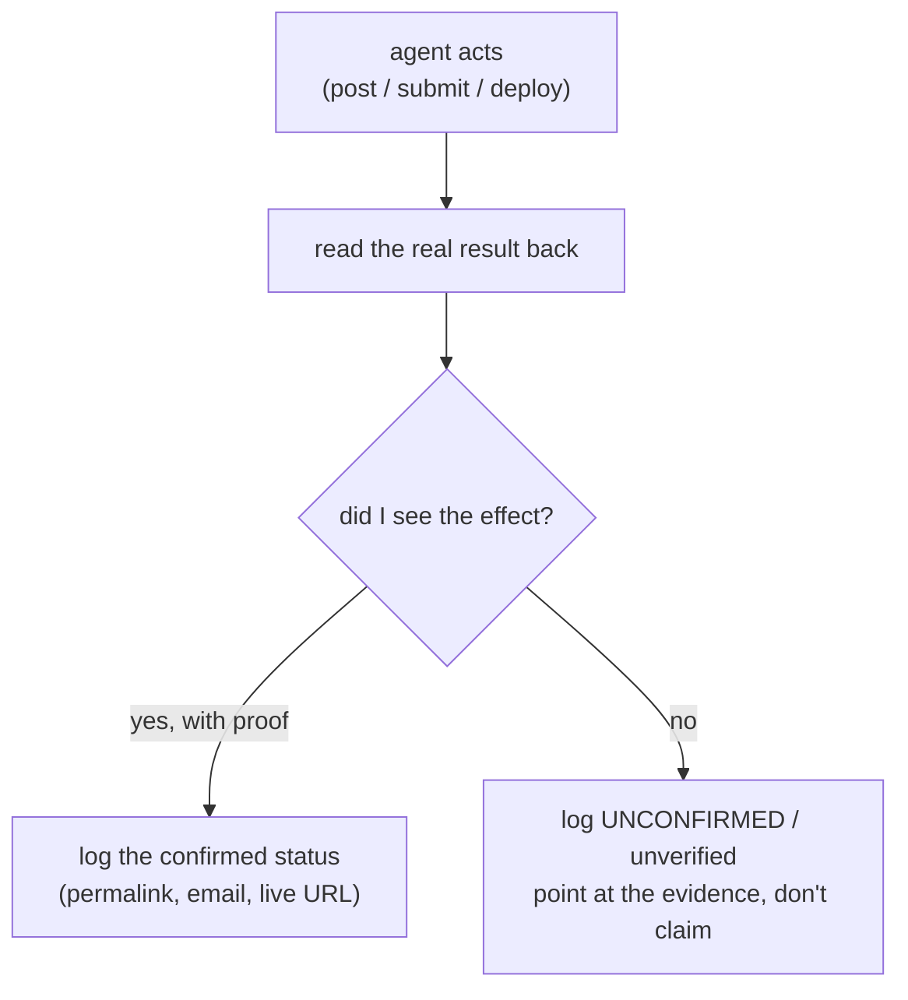

Most demos of autonomous agents quietly assume someone is watching. The failure mode they hide is not the agent doing nothing. It is the agent doing nothing while reporting success. A button fires, a toast appears, a status flips to "sent," and the thing the user actually needed never happened. I run several agents unsupervised: one [posts to a real X account](/notes/x-agent), one [applies to jobs](/notes/jobright-agent) through company ATS forms, and this portfolio partly maintains itself. None of them is safe because the model is smart. They are safe because each one is built to fail closed and to report exactly what it did and did not verify.

This is the discipline I mean by honest automation. It is downstream of [determinism around stochasticity](/notes/determinism-around-stochasticity): once you accept that an LLM call is a sample you cannot trust on its own, two questions follow. What does the agent do when it is not sure? And what does it tell you afterward? Get both wrong and unsupervised becomes a synonym for unaccountable.

## Fail closed: the unsafe default is to stop

A gate that passes when it cannot tell is worse than no gate, because it manufactures confidence. So every protective check I run is built to block, not pass, when it is unsure or when its own setup is wrong.

The sharpest version of this lives in x-agent's `privacy_scan.py`, the deterministic filter between my private knowledge base and a public post. It catches the mechanical leaks: a real name, a dollar amount, an exact date, a private-tier source. The part that matters most is what happens when its own rules fail to load.

```python title="privacy_scan.py (the fail-closed assertion)" {3-5}
# If the wiki root is non-empty but the protective name set loads EMPTY,
# the loader is mis-pointed (wrong layout, bad root). An empty protective
# set is a CONFIG ERROR, not "nothing to protect".
if not names and wiki_root_is_nonempty(wiki_root):
    sys.exit(2)   # exit 2 = config error. Never exit 0.
```

An empty rule set is the tempting trap. Nothing matched, so nothing is wrong, so let it through. That reasoning is exactly backwards. If the knowledge base is full but the protective name set came back empty, the scanner is pointed at the wrong place, and "found nothing" means "checked nothing." It exits 2, a config error, and refuses to bless the post. Empty means mis-pointed, not safe.

:::warning{title="Default-deny, not blocklist"}
The candidate sweep that picks which pages may even be considered for a post is default-deny: a page is shareable only if it positively proves it is safe, and a page that is "merely not blocked" falls straight through to denied. A blocklist asks "is this one of the bad things I listed?" A default-deny gate asks "have you shown me this is safe?" The second is the only one that holds when you forgot to list something.
:::

The same instinct runs through the voice gate, `tweet_composer.py`. It is not a generator, it is a validator that exits 1 the moment it finds an AI shape-tell, and it ships with a `--selftest` of known-bad fixtures that must each fail. A check no failure ever trips is decoration, so the gate is itself gated. Fail-closed is not one feature. It is the default posture every check is written in.

## Never claim an effect you cannot see

The second half of honest automation is what the agent says after it acts. The rule is blunt: a success banner is the page talking, and the page is not proof. So before the agent believes anything, it reads the result back.

x-agent's posting script types the approved text, clicks send, and then goes and looks. It does not trust the compose box clearing. It reads the timeline back, finds the new post's real permalink, and only then prints a status.

```js title="x-post-playwright.mjs (status comes from the read-back, not the click)"
// `posted` is true only after the read-back actually finds the post.
done(posted ? 'POSTED' : 'UNCONFIRMED',
     postedUrl ? postedUrl : '(no confirmation — check screenshot)')
// prints:  POST STATUS: POSTED | UNCONFIRMED | ERROR
```

The status is honest about what it could confirm. `POSTED` means it saw the post and captured the permalink. `UNCONFIRMED` means the send may have gone through but the read-back did not catch it, so it says so and points at a screenshot instead of pretending. `ERROR` means it broke. The agent never upgrades a status it could not verify, and each post is logged once, idempotent by url, so the same send is never double-counted and never invented.



[jobright-agent](/notes/jobright-agent) carries the same rule one step further, because a job application is irreversible and lands on someone else's desk. It verifies a submit on two independent channels, the on-screen banner and a confirmation email scoped to the platform's domain, and records a four-rung status ladder: `confirmed` (an email actually arrived), `submitted-no-email` (banner shown, platform sends no applicant email), `unverified` (the banner could not be read), and `failed` (rejected by a spam block or validation error). Across the real run history the log carries the full spread, failures and all. That honesty is the point. An agent that logged everything as "applied" would be lying to the only person who depends on it.

This site holds itself to the identical standard. The portfolio agent's deploy step does not end at "I ran the deploy script." It curls the live GitHub Pages URL, retries until Pages rebuilds, and confirms the new article is actually there. The rule, written into the runbook, is "never claim a deploy you can't see." A deploy that did not land is reported as not live, not as shipped.

## The human-approval floor for irreversible actions

Fail-closed gates and honest status handle the things the agent can check. Some actions you do not let it check at all, because they cannot be taken back. For those there is a hard wall: the agent prepares everything and a human presses the button that commits.

jobright-agent is the clearest case. It reads the feed, picks roles that genuinely fit, drives the ATS form, fills every field correctly, and then stops.

:::note{title="Trusted to do the work, not to decide it's good enough to send"}
The agent drafts and prepares the full application, shows the filled form, and clicks the real Submit only after the user approves it, every time. A real application goes to a real company, so Submit is treated like a post-to-the-world action. The tedious ninety-five percent is automatic; the five percent that actually commits is gated.
:::

The boundary is not paranoia, it is a clean split of authority. The agent is reliable at the mechanical work, the typing, the routing, the verification, the bookkeeping. It is not authorized to decide that the work is good enough to send irreversibly. That decision stays human. The same floor sits in front of an original X post (a human approves it after four stacked machine checks) and in front of every deploy of this site (the lead reviews before publish; the worker that wrote the article is never its own final gate, mirroring the family's rule that [the checker is never the author](/notes/independent-verification)).

## Two lines the agent will not cross

Honest automation also means refusing two specific temptations, both of which would let the agent fake progress instead of reporting a stop.

The first is defeating an explicit anti-bot control. jobright-agent does not solve CAPTCHAs. A CAPTCHA is a hard stop, not a puzzle: it fills everything else, records the job as walled, and leaves the final click to a human on a normal browser. The dispatcher even recognizes known-walled platforms up front and bails before filling anything, rather than burning a run pretending it can get through. Crossing an explicit "prove you are human" gate is exactly the kind of overclaim the whole design exists to prevent.

The second is inventing data the agent does not have. If a required field is genuinely personal and not in the profile, a mailing address, a salary, a demographic question, the agent stops and asks. It does not guess. Motivation essays are drafted only from real experience on the resume, never fabricated. The privacy scanner's whole job is to keep what is private from leaking out; the never-invent rule is its mirror, keeping what is unknown from being made up. An agent that fabricates a plausible answer is doing the same dishonest thing as one that logs an unverified send as success. Both replace "I don't know" with a confident lie.

## Why this is the load-bearing idea for autonomy

You can make an agent more capable without making it more trustworthy, and the gap between the two is where unsupervised work goes wrong. A more capable model fills forms faster and writes smoother posts. It does not, on its own, refuse to ship when it cannot tell, and it does not volunteer that a send was unconfirmed. Those are properties of the system around the model, not the model itself.

So the order is fixed, the same order every honest agent in my fleet is built in. Decide the irreversible action. Put a fail-closed gate in front of it, one that blocks when unsure and errors when mis-configured. After the action, read the real effect back and log only what you saw. Put a human on the button that cannot be undone. Then, and only then, let it run while you sleep. The model proposes. The deterministic gates dispose. And the agent reports precisely what it did, and what it did not verify.
