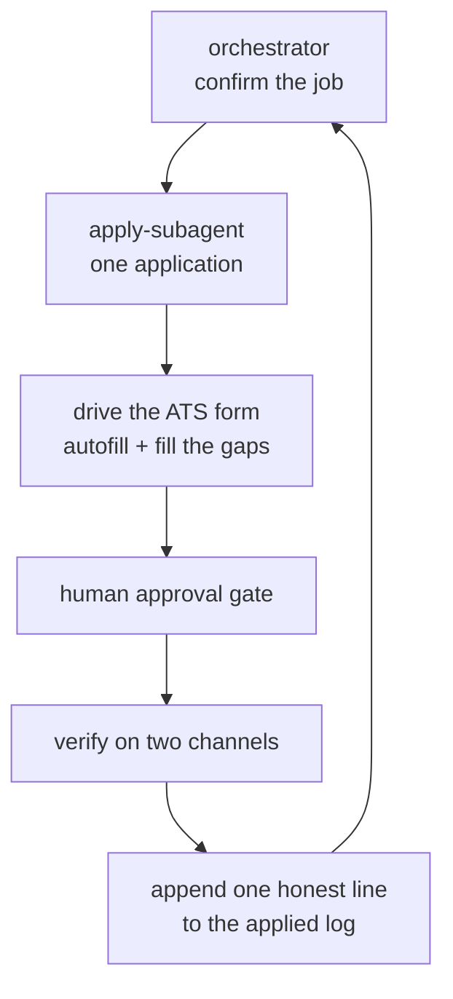

I wanted to find out how much of a job search a careful agent could actually run on its own. Not a spam cannon that fires resumes at every posting, but something that reads the recommendations, picks roles that genuinely fit, fills the application correctly through whatever applicant-tracking system the company uses, and knows the difference between "I submitted this" and "I think I submitted this." The result is `jobright-agent`, packaged as a self-contained `jobright-apply` skill, and it is one of the real unsupervised workers in my [agent fleet](/notes/my-agent-teams).

The core tension in this kind of automation is that the action is irreversible and it lands on someone else's desk. A bad tweet you can delete. A job application sent to a real company with a tailored resume attached is out the door. So the whole design is built around that fact: do the tedious 95 percent automatically, and put a hard wall in front of the 5 percent that actually commits.

## The hard gate: never auto-submit

The single most important rule in the skill is that the agent does not click the real Submit button on its own.

:::warning{title="The submit gate"}
The agent drafts and prepares the application, then stops and shows the filled form before the final Submit. It clicks the ATS's real Submit button only after the user explicitly approves it. A real application goes to a real company, so Submit is treated like a post-to-the-world action: approval required, every time.
:::

This is the same instinct as the [honest-automation](/notes/independent-verification) discipline across the rest of the fleet. The agent is trusted to do the work, not to decide that the work is good enough to send. When I run it as an unattended loop I can authorize auto-submit for that session, but the accuracy of what goes out is never negotiable, and CAPTCHAs and missing personal data still stop it cold (more on both below).

## One application per run, in a throwaway subagent

Driving a web form is expensive in the way that matters to an agent: it is screenshot-heavy and chatty, and that context piles up fast. So the work is split. A long-lived orchestrator holds the plan and confirms the job. Then it spawns one disposable apply-subagent to do the heavy lifting for a single application, and keeps only that subagent's short report. This is the same [bounded-context](/notes/my-agent-teams) split the rest of the fleet uses: the orchestrator stays lean and strategic, the grunt work happens in a context you throw away.



The split is deliberate about who writes what. The factual log of every application is a flat append-only file, and the subagent writes its own line directly. But the shared knowledge file of ATS footguns is curated by the orchestrator: the subagent only reports candidate gotchas in its summary, and the orchestrator decides what to seal in, dedup, and generalize. That keeps the knowledge base coherent across dozens of runs instead of accumulating overlapping notes from parallel workers.

## Pick the right job, then route by ATS

The recommendations feed on Jobright is a virtualized list, so a naive DOM scrape only ever sees a handful of cards. The agent goes to the underlying API instead and pulls the real pool, then filters to the target lanes and skips anything already in the applied log so it never double-applies.

The interesting part is what happens after "Apply." Every posting eventually hands off to some applicant-tracking system, and they behave completely differently. So there is a dispatcher: it drives the autofill flow to reach the real ATS, reads the host, and routes to a handler that knows that platform's quirks. Crucially, if the host is a known-walled platform, it bails before filling anything.

```js title="ats/dispatch.mjs" {2-6}
function routeFor(host) {
  if (/ashbyhq\.com/i.test(host)) return 'ashby';
  if (/greenhouse/i.test(host)) return 'greenhouse';
  for (const w of WALLED) if (w.re.test(host)) return `skipped-walled:${w.name}`;
  return 'skipped-walled:unknown';
}
```

The walled list exists because I mapped every platform the hard way. Some gate submit behind an image CAPTCHA. Some redirect an automated browser back to a homepage so the form never renders. Some reset their sign-in under automation. Rather than fight each one and burn a run, the dispatcher recognizes them and records the job as walled, leaving it for a human on a normal browser. The two platforms the unattended loop reliably lands are the captcha-free ones, and the agent knows which those are.

## Two-channel verification: never claim a submit you can't see

A success banner is the page talking. It is not proof the application went through. The agent verifies on two independent channels and records an honest status:

:::note{title="The honest-status ladder"}
`confirmed` means a confirmation email actually arrived. `submitted-no-email` means the banner appeared but the platform sends no applicant email (common, not a failure). `unverified` means the banner could not be read. `failed` means it was rejected (a spam block or a validation error) and did not go through. The agent never upgrades a status it could not check.
:::

The classifier reads the post-submit page and looks for the real signals: a success phrase, a "required field" error, a spam rejection, or a CAPTCHA challenge. The email side runs a search of the application inbox scoped to the platform's domain in the last hour. Only when a confirmation actually lands does the status become `confirmed`. This is the same rule the [x-agent](/notes/my-agent-teams) follows when it posts: read the result back, and if you can't see it, say so.

Across the real run history the log carries the full spread of those statuses, including failures and walled skips. That honesty is the point. An agent that logged everything as "applied" would be lying to the only person who depends on it.

## The ATS gotchas are where the real engineering lives

Anyone who thinks form-filling is trivial has not automated a modern ATS. A few of the footguns that are now encoded so the agent doesn't relearn them:

- **React controlled inputs ignore injected values.** Setting a field's value programmatically updates what you see but not React's internal state, so the form validates against empty and rejects the submit even though every box looks full. The fix is to type every value key by key, then blur the field so React's change handler fires.
- **The submit itself looks like a bot.** A fully-filled form submitted from an automated browser gets flagged as possible spam. The launch masks the automation fingerprint and adds human-like mouse movement and dwell before the click. Autofill works fine; only the final commit is sniffed.
- **Verification codes rotate on every submit.** One platform emails a fresh code on each submit and invalidates the last one, so the obvious "submit, fetch code, resubmit" loop always fails because the resubmit rotates the code again. The right flow is a one-shot handshake: submit once to reach the code screen, then enter the code that just arrived on that screen without re-submitting the form.

```js title="ats/_lib.mjs (type, never inject)" {6-7}
export async function typeInto(page, loc, val, set, key) {
  const el = loc.first();
  if (!(await el.isVisible().catch(() => false))) { set[key] = 'not-visible'; return false; }
  await el.scrollIntoViewIfNeeded().catch(() => {});
  await el.click().catch(() => {});
  await el.fill('').catch(() => {});
  await el.type(val, { delay: 14 }).catch(() => {});   // key by key, so React registers it
  await el.dispatchEvent('blur').catch(() => {});       // fire the synthetic onChange
  const got = ((await el.inputValue().catch(() => '')) || '').trim();
  return got === String(val).trim();
}
```

These notes accumulate into a real knowledge base, which is the [ratchet](/notes/the-ratchet) at work: a footgun the agent hits once becomes a sealed gotcha so it never costs a run twice.

## Where the agent stops and asks

Two lines it will not cross. It does not solve CAPTCHAs, because defeating an explicit anti-bot control is dishonest and image-solving is unreliable anyway, so a CAPTCHA is a hard stop. And it does not invent personal data: if a required field is something genuinely personal that isn't in the profile (a mailing address, a salary, a demographic question), it stops and asks rather than guessing. Motivation essays are drafted only from real experience on the resume, in a plain human voice, never fabricated.

That is the honest version of "applies to jobs while I sleep." The agent does the tedious driving, the form quirks, the verification, and the bookkeeping. It does not pretend to be me, it does not lie about what it sent, and it does not push the button that matters without a person saying go.
