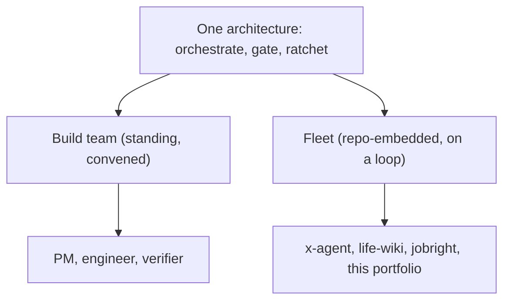

I build and run AI agents in two distinct shapes. The first is a **standing build team**: a PM, an engineer, and an independent verifier I can convene to take a feature from idea to shipped, verified code. The second is a **fleet of repo-embedded agents**, each one living inside the project it maintains and running on its own loop: an X account that posts in my voice, a wiki that compiles my life from years of chat logs, a job-application agent, and the agent that maintains this very portfolio.

They look like different things. They aren't. Both shapes run the same architecture, in the same order (**orchestrate → gate → ratchet**), and the rest of this section is the depth behind those three moves.

## The thesis, in one paragraph

A long-lived **orchestrator** holds the plan and does none of the grunt work; it delegates each discrete unit to a fresh, throwaway subagent so context stays lean and quality doesn't decay mid-job. Every stochastic step is wrapped in a deterministic, fail-closed **gate**, because a model's output is a probability distribution, so you don't trust a single run, you check it. And when something slips through anyway, you fix the **program, not the output**: the skill or spec is edited so that class of miss can't recur. That last move is the **ratchet**, and the floor only goes up. Read end to end in [Orchestrate → Gate → Ratchet](/notes/orchestrate-gate-ratchet).

## Shape 1: the build team (PM → engineer → verifier)

A standing, user-level team I convene for substantive software work:

- **PM** owns the *what* and *why*, and the **golden bar** (a real, non-toy reference a build is measured against), gated behind explicit human design approval before any code is written.
- **Engineer** builds to the approved scope, writes the docs, and writes the tests.
- **Verifier** independently grades the result and is **read-only on source: it never authored the code it checks.** Its verdict alone decides ship vs. bounce-back.

The independence is the point: the author is the worst grader of their own work, because they test the code path they wrote rather than the outcome the user needs. The full argument (plus the four gates the verifier runs and the production bug that taught me a green test suite can certify a feature that does nothing) is in [Independent verification](/notes/independent-verification).

## Shape 2: the fleet (repo-embedded agents on a loop)

Each fleet agent is a long-lived orchestrator embedded in one repo, running the same orchestrate → gate → ratchet play against a different surface. All four exist and run on this box today:

- **x-agent** drives an X account end-to-end: it finds posts and writes replies, and writes original posts from the life-wiki, each one behind a hard **privacy gate** and a **voice gate** before it can go out.
- **life-wiki** is an LLM-maintained clone of one person's life (built on Karpathy's LLM-Wiki pattern): it *compiles* years of chat history into an interlinked, time-aware set of pages, under a strict **never-fabricate** rule where every claim must cite a source anchor.
- **jobright-agent** automates job applications, with the heavy per-application work running in subagents and a **human-approval gate** before anything is submitted.
- **this portfolio** is a repo-level agent that maintains this site on a weekly loop via a pluggable skill registry (`portfolio-refresh`, `portfolio-write`), gated for honesty and confidentiality before any deploy.

*(This is a concise map; a deeper per-agent write-up is to-be-expanded.)*

## The cross-cutting ideas

The three concept pieces below are the real depth. Each is one move of the architecture, drawn straight from how these systems actually work:

- **[Orchestrate → Gate → Ratchet](/notes/orchestrate-gate-ratchet)**: the whole architecture, and why the order matters.
- **[Independent verification](/notes/independent-verification)**: killing "looks-done-but-isn't"; the author is never the checker.
- **[The ratchet](/notes/the-ratchet)**: systems that raise their own quality floor and never fall back.

*(More to come: per-team write-ups and additional concept pieces are queued. Marked to-be-expanded.)*
