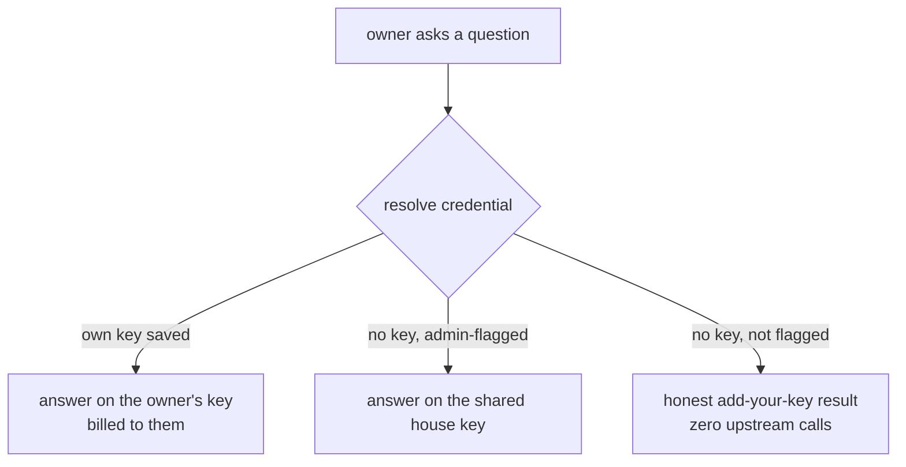

Nucleus is a real production AI assistant I built for a private client. Users upload their own documents and data, then ask business questions and get answers cited back to the source. It runs on a hosted model (Claude), and it is multi-tenant: many users, one deployment. That combination hides an easy, expensive mistake. If every user's question runs on one shared model key, one account pays for all of them, and nobody using the app can see that it is happening. The bill just grows.

The honest version is bring-your-own-key. Each user pastes their own model API key, billed to them. The deployment keeps one shared "house" key, but it answers only for accounts an admin has explicitly allowed, so no one rides it silently. And because a wrong or expired key is a bad first experience (you ask a real question, wait, and get a failure), a pasted key gets validated the moment you save it, with a check that costs nothing. This piece walks those three mechanisms from the real code. The client is not named here; this is mechanism only.

## One seam decides which credential answers

The app has two answer engines: a plain Messages-API path and an agentic path that runs the Claude Agent SDK. If each one had its own "which key do I use" logic, the policy would drift the first time I touched one and not the other. So credential resolution lives in exactly one place, and both engines call it.

The resolver returns one of three outcomes: the owner's own key, the house key, or nothing.

```ts title="src/lib/engine/anthropic-auth.ts (resolveAnthropicAuth)" {2,4}
const ownKey = ((await getSetting("anthropic_api_key", ownerId).catch(() => "")) ?? "").trim();
if (ownKey) return { kind: "own", apiKey: ownKey };
const flagged = (((await getSetting("house_key_enabled", ownerId).catch(() => "")) ?? "").trim()) === "1";
return flagged ? { kind: "house" } : { kind: "none" };
```

Two things in those four lines matter more than they look. The order is own-key first: a user who saved their own key always answers on it, never on the shared one, so the app can't accidentally bill the deployment for someone who is paying their own way. And every settings read is wrapped in `.catch(() => "")`. If the database hiccups, the resolver degrades to "no own key" and "not flagged" instead of throwing. A transient error yields the honest no-key result, not a scary crash, and critically it never fails *open* onto the shared key.

When the answer is "none," the caller does not call the model at all. It returns a normal answer-shaped result that says, in plain words, add your key:

```ts title="src/lib/engine/anthropic-auth.ts (noKeyAnswer)" {5,6}
return {
  question,
  route: { sources: [], docFilter: null, rationale: "No Anthropic API key is configured for this account." },
  answer: NO_KEY_MESSAGE,
  mode: "general",
  grounded: false,
  evidence: { rows: [], chunks: [] },
  validation: { ok: true, reasons: [] },
  model,
};
```

That shape is deliberate. The frontend already knows how to render an `AnswerResult`, so a user with no key gets a clean, guided message in the normal answer slot rather than an error banner, and the app made zero upstream calls to produce it. The guidance text lives in one exported constant (`NO_KEY_MESSAGE`) so the engines, the tests, and the UI can't say three different things.



The agentic engine has one extra wrinkle. It runs the model in a subprocess through the Agent SDK, and the SDK's `env` option is not merged with the parent environment. So for an owner's own key, the resolver builds a fresh env object that copies the parent env and overrides just the credential, per request, never mutating the shared `process.env`:

```ts title="src/lib/engine/answer-agentic.ts (own-key injection)" {5}
options: {
  model,
  // Owner's OWN key -> force it into the SDK subprocess env (the SDK's env is NOT
  // merged with process.env, so ownKeyEnv() spreads the parent env + overrides the
  // credential). The house case passes no env override -> inherits process.env.
  ...(auth.kind === "own" ? { env: ownKeyEnv(auth.apiKey) } : {}),
```

Building a new object per call is what makes it concurrency-safe. Two users answering at the same moment each get their own env with their own key; neither touches a shared global. The house case passes no override and inherits the deployment's environment exactly as before.

## The shared key is an allowlist, not a default

The whole point is that nobody rides the shared key silently, so the shared key is gated by an explicit per-user flag. A row in the settings table with `house_key_enabled = "1"` means "this account may fall back to the house key." Absence means no.

The important property is *who* can write that flag. A user can save and delete their own key freely, but the allowlist flag is admin-only. It is written from exactly one route, the admin Users panel, and the per-user settings route deliberately refuses to touch it:

```ts title="src/app/api/admin/users/route.ts (setHouseKey)" {4}
if (action === "setHouseKey") {
  if (!id) return NextResponse.json({ error: "id is required" }, { status: 400 });
  const enabled = body.enabled === true;
  await setSetting("house_key_enabled", enabled ? "1" : "", id);
  return NextResponse.json({ ok: true, id, houseKeyEnabled: enabled });
}
```

That route is guarded at the top by an admin check; a plain user gets a 403 before reaching this line. So a user cannot flag themselves onto the shared key. The allowlist can only be granted by an admin, toggled per account from the Users panel, where each row shows whether that user is currently on it.

:::note{title="Grandfathering, done additively"}
When this shipped, the app had existing users who were all already answering on the shared key. Flipping them to off overnight would have cut their access. So the migration that introduced the allowlist seeds the flag on for every account that existed at that moment, and only for those, using an insert that does nothing on conflict. It never overwrites a key, never removes a flag an admin later changes, and accounts created afterward have no such row, so they default off and must add their own key or be flagged. Existing behavior was preserved; the new default (off) applies going forward.
:::

I am not publishing who is on the allowlist. The mechanism is a per-user flag written only by an admin; the contents are the client's.

## Write-only keys, and proving one works for free

A saved key has to be usable by the engine but never readable by anyone, including the person who saved it. So the key is write-only over the API. When you save, the server derives and stores only three non-secret facts (a name you gave it, the last four characters, and the created timestamp) and never returns the value again:

```ts title="src/app/api/settings/route.ts (saving the key)" {5,6,7}
} else if (k.trim()) {
  const key = k.trim();
  await setSetting("anthropic_api_key", key);
  await setSetting("anthropic_api_key_last4", key.slice(-4));
  await setSetting("anthropic_api_key_created", new Date().toISOString());
  if (name !== undefined) await setSetting("anthropic_api_key_name", name);
}
```

The read side (`getSettings`) returns `anthropic_api_key_set` as a boolean and the name / last four / created, but omits the key itself from the type entirely. So the settings panel can show a "your key" row (a name, four masked-off characters, an added-on date) without the secret ever leaving the server. A blank submit is treated as "leave the stored key alone," so re-saving the rest of the form does not wipe your key; clearing is an explicit sentinel that also drops the metadata.

That solves storage. It does not solve the worst moment in the flow: you paste a key, save it, and only find out it was wrong when you ask a real question and wait for a failure. The fix is a Test connection button. The obvious way to implement it (send a tiny message to the model and see if it answers) works, but it spends tokens every time someone clicks it. On someone else's key that is rude, and on your own it is a papercut.

There is a better probe. Listing the available models is an authenticated request that bills nothing. It proves the credential is real and accepted, and it never generates anything. So the per-user key test resolves the same client the real answer path uses, then calls `models.list()` and nothing else:

```ts title="src/app/api/test-connection/route.ts (testAnthropicKey)" {5,6}
try {
  // ONE metadata request - no messages.create, no tokens. `.data` is the first page.
  const page = await resolved.client.models.list();
  const model = page?.data?.[0]?.id ?? "claude";
  return NextResponse.json({
    ok: true, mode: "cloud", provider: "anthropic", model,
    message: "Connected - your Anthropic API key works.",
  });
} catch (e) {
```

:::tip{title="Why models.list() and not a one-word message"}
`client.models.list()` is a GET against the models endpoint. It requires a valid key (a bad one 401s, which is exactly the failure we want to surface), but it runs no inference, so it costs zero tokens. `messages.create` would validate the key too, but it bills for the generation on every click. Same signal, no cost. The test reuses the engine's own resolver, so it validates the exact credential a real answer would use, not a separate probe that could pass while the real path fails.
:::

Two more habits show up in that route. It never returns or logs the key: a success says only that the key works and which model responded, and any provider error is run through a redactor that strips bearer tokens and long key-shaped runs before it reaches the client or a log line. And it never 500s on a bad key; a rejected credential comes back as `{ ok: false }` with a friendly, key-free message, not a stack trace. The point of a connection test is to fail gracefully.

## The through-line

None of this is a big system. It is one resolver that both engines share, one flag that only an admin can set, a key the server holds but never hands back, and a probe that authenticates without generating. But together they change who pays and who knows. A user pays for their own usage on their own key. The shared key answers only for accounts explicitly put on the list, so no one rides it by accident. And a pasted key gets proven real before it is trusted with a question, for free. The expensive default (everyone quietly on one key) is the kind of thing that works fine in a demo and surprises you on the invoice. Making the boundary explicit, and validating it cheaply, is the same fail-closed discipline I hold everywhere else in the fleet: [name what you did not verify, and verify what you can for free](/notes/honest-automation).
