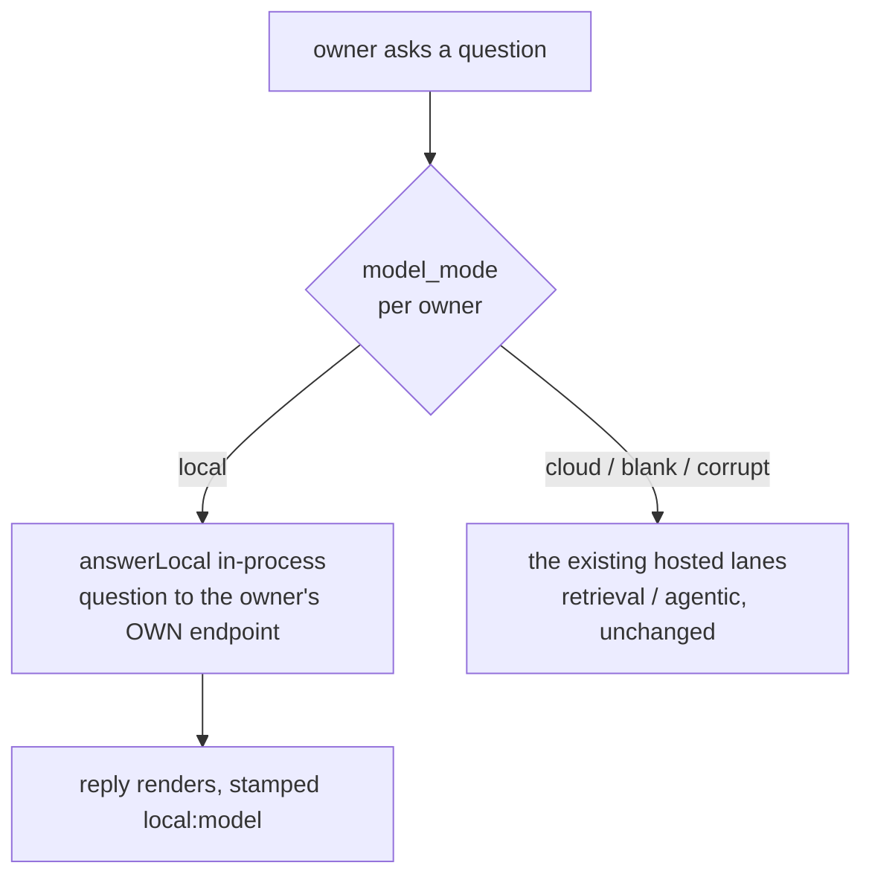

Nucleus is a real production AI assistant I built for a private client. Users upload their own documents and data, then ask business questions and get answers cited back to the source. It runs on a hosted model and it is multi-tenant: many users, one deployment. That default is fine for most data. It is a non-starter for the other kind. If a user works with regulated or sensitive material, "your question and your files get sent to a cloud AI provider" is the wrong answer, no matter how good the retrieval is.

Local mode is the option for that user. Flip one setting and the model that writes the answer runs on their own hardware, from their own model, reachable only by them. The question and the reply never leave the machine for the AI step. The interesting engineering is not the local model itself (Ollama already exists and speaks a standard protocol). It is that this is one setting, not a second product: the same codebase, the same UI, the same answer shape, rerouted at request time by a single value. This piece walks how that switch works, from the real code. The client is not named here; this is mechanism only. It is the privacy sibling of [bring-your-own API keys](/notes/nucleus-byo-keys): both are the "keys and privacy" story, one about who pays, this one about where the data goes.

## The switch is a per-owner setting

The whole feature hangs off one stored value, `model_mode`, resolved per user at request time. It has three states, and the resolver deliberately fails safe:

```ts title="src/lib/engine/settings.ts (getModelMode)" {3}
export async function getModelMode(): Promise<ModelMode> {
  const v = (await getSetting("model_mode")).trim().toLowerCase();
  if (v === "local") return "local";
  // … other opt-in privacy modes match here …
  return "cloud"; // anything unrecognized fails safe to the hosted path
}
```

The default matters. Anything that is not an exact, recognized privacy mode like `local` resolves to `cloud`, which is the normal, fully-configured hosted path. So a blank setting, a typo, or a corrupt row can never leave a request half-routed to a backend that is not really wired up. The safe direction is the working one. A user opts in to Local; they do not fall into it by accident.

The setting is written from the real Settings panel, per owner, alongside two companions: the `local_endpoint` (the address of the user's own model server, e.g. `http://localhost:11434/v1`) and the `local_model` (which model on that box to ask). Those are the only three values Local mode needs. There is no key, because it is the user's own machine.

## One dispatch point reroutes the whole answer path

Nucleus has more than one answer engine. There is the hosted retrieval pipeline, an agentic path that can run on a separate compute tier, and now the local path. The temptation with a privacy mode is to build a parallel app: a "local build" that drifts from the real one the first time you touch either. I did not want that. So Local mode is not a separate engine wired in beside the others. It is a branch at the single point where the answer route already decides which lane to run.

The `/api/ask` route resolves `model_mode` under the requesting user's context, then picks the lane:

```ts title="src/app/api/ask/route.ts (lane dispatch)" {1,3,4}
const modelMode = await runWithOwner(user.id, () => getModelMode());
// ...
const result = modelMode === "local"
  ? await runWithOwner(user.id, () => answerLocal(question, user.id, sessionId, history, spaceOpts))
  : (USE_AGENTIC && FLY_AGENT_URL && INTERNAL_AGENT_TOKEN)
  ? await runWithOwner(user.id, () => forwardToFlyAgent(question, user.id, sessionId, history, modelOverride, spaceOpts))
  : USE_AGENTIC
  ? await runWithOwner(user.id, () => answerAgentic(question, user.id, undefined, sessionId, history, spaceOpts))
  : await runWithOwner(user.id, () => answerQuestion(question, { ownerId: user.id, /* ... */ }));
```

Two properties of that one line carry the whole feature.

First, `local` is checked before the cloud lanes, and a local answer runs `answerLocal` in-process. It is never handed to `forwardToFlyAgent`, the path that ships a question off to the hosted agent tier. So when a user is in Local mode, their question physically cannot take the cloud route. The privacy guarantee is structural, not a promise in a system prompt. The branch that would send it to a cloud provider is not reachable from the local lane.

Second, the `cloud` case is `EXACTLY` the code that ran before this feature existed. Local mode added a branch; it did not rewrite the existing engine. That is what makes it one product instead of two. A change to retrieval, spaces, history, or auth lands once and both modes get it, because below this dispatch they are the same app.



There is also a second opt-in privacy mode selectable in Settings whose dedicated backend is not wired on this deployment. It shows the same discipline: rather than silently route that traffic to the ordinary cloud model, the route returns an honest 503 that says so. A privacy mode that quietly downgrades to a non-private backend is worse than no mode. Fail closed, say why.

## The question round-trips through the user's own model

Inside the local lane, `answerLocal` does the actual round-trip. It reads the owner's endpoint and model, builds the chat messages (a system prompt, the recent history, the new question), and POSTs them to the user's own OpenAI-compatible server:

```ts title="src/lib/engine/answer-local.ts (the round-trip)" {2,7}
const endpoint = (await getSetting("local_endpoint", ownerId)).trim();
const model = (await getSetting("local_model", ownerId)).trim() || "qwen2.5";
// ...
const base = endpoint.replace(/\/+$/, "");
res = await fetch(`${base}/chat/completions`, {
  method: "POST",
  headers: { "Content-Type": "application/json", Authorization: "Bearer ollama" },
  body: JSON.stringify({ model, messages, temperature: 0 }),
  signal: controller.signal,
});
```

That is the entire network boundary of a Local answer. The only outbound call is to the address the user typed, which points at their own machine (or, in the self-host setup, the same box the app runs on). No hosted AI provider is contacted. The `Authorization` header is a placeholder that keeps strict clients happy; Ollama ignores it, because there is no billed key here. It is the user's hardware.

Ollama already speaks the OpenAI chat-completions protocol, so there was no local service to write. The user runs one command to pull a model, and the endpoint exists. Nucleus just has to send the request to a different base URL. That is the quiet reason this is a setting and not a rewrite: the same "send messages, get a completion" shape works against a cloud provider and against a box on someone's desk. The address is the variable.

:::note{title="Local is not the same as fully offline"}
Switching the model to Local puts the AI that writes the answer on the user's hardware, which is the biggest privacy piece. It does not, by itself, make the whole app offline: logins still run through the hosted auth, for example. The honest framing (which the docs state plainly) is that Local moves the model, and a full air-gap is a further step of self-hosting the rest. Overselling "fully offline" would be exactly the kind of claim this whole design exists to avoid.
:::

## Honest about what this version can and cannot do

Here is where it would have been easy to cheat. A small model running on a plain CPU box cannot do the document retrieval and citation work the hosted engine does. The dishonest move is to run the local model anyway and let it emit citation-shaped text about files it never read. That produces confident, fabricated answers about a user's own documents, which is the worst failure a document assistant can have.

So this version of Local mode is deliberately chat-only, and it is built to say so. The answer is always ungrounded, carries no evidence, and is tagged with the local model so a caller can prove the local path actually ran:

```ts title="src/lib/engine/answer-local.ts (the honest result shape)" {4,5}
return {
  question,
  route,
  mode: "general",
  grounded: false,
  answer: content || "(the local model returned an empty reply)",
  evidence: { rows: [], chunks: [] },
  validation: { ok: true, reasons: [] },
  model: modelLabel, // "local:<modelname>"
};
```

The guardrail against fabrication is at the prompt level, not a keyword filter. The system prompt tells the model, in plain language, that in Local mode it cannot read the user's uploaded files, names the files that exist in scope so it can acknowledge them specifically, and forbids guessing their contents:

```ts title="src/lib/engine/answer-local.ts (buildLocalSystemPrompt)"
`If the user asks anything about these documents or what they contain, say plainly
that Local mode cannot read uploaded documents yet, and that they can switch to Cloud
mode to ask about their files. Do NOT guess or invent what any document says.`
```

Reading documents in Local mode is the designed next version, for when the hardware can run a model big enough to take the file text directly in its context. That upgrade is scoped in the docs. It is not shipped, and the code does not pretend it is. Until then, Local mode does the one thing it can do well (chat, on the user's own model) and refuses the one thing it cannot (reading files) out loud.

:::tip{title="Why grounded=false is the honest default"}
The cloud engine earns `grounded: true` by actually retrieving and citing real chunks. Local mode reads no documents, so returning `grounded: false` with zero citations is not a limitation to paper over. It is the truthful signal the UI needs to render a plain chat answer with no source chips, so a user is never shown a citation that does not exist. The mode advertises its own honesty in the shape of its result.
:::

## It degrades gracefully, never crashes

A privacy feature that throws a stack trace the first time the user's endpoint is misconfigured would push people right back to the cloud. So `answerLocal` never throws. An unset endpoint returns a calm, answer-shaped setup message. An unreachable one (Ollama not running, wrong URL, a tunnel down) returns a message that names the address and fails in a few seconds rather than hanging:

```ts title="src/lib/engine/answer-local.ts (unreachableResult)" {5}
return {
  question,
  route: { sources: [], docFilter: null, rationale: `Local mode: the local model at ${endpoint} could not be reached (${detail}).` },
  answer: `Local model endpoint unreachable at ${endpoint} — is Ollama running, and (if it's remote) is the tunnel up? Check the endpoint in Settings → Model, make sure your model server is running and the model is pulled, then try again.`,
  mode: "general",
  grounded: false,
  localGuidance: "unreachable",
  model: `local:${model}`,
};
```

Both the "not configured" and "unreachable" results are friendly `200`s carrying a `localGuidance` flag, so the Ask surface shows a setup note instead of an error banner. A dead host fails fast because the TCP connect is refused immediately; a routable-but-slow box (a remote model reached over a tunnel) is bounded by a timeout well under the route's own budget, so a slow local model never hangs the request. The failure mode of a privacy feature is part of its design, not an afterthought.

One more honest detail sits in the cost accounting. The shared inspector that builds the answer's usage block prices calls at the hosted provider's rates, which is simply wrong for a call that ran on the user's own hardware and touched no paid API. So the local path overwrites that block to report a `$0` call attributed to the local model. A cost meter that billed a free local call would be a small lie, and small lies in a tool people trust for privacy are not small.

## Verified on a real box, with zero cloud spend

I did not want to claim "it runs locally" from a unit test that mocks the endpoint. So the feature has a journey that drives the real UI against a real Ollama on a real box, and every question in it hits the local model, which means the whole journey spends nothing on the cloud provider. It selects Local in Settings and saves through the actual panel, runs a Test connection against the live endpoint, sends a chat message and asserts both that the reply rendered and that the response JSON's `model` starts with `local:` (proving the local lane, not a cloud lane, produced it), then asks about "my uploaded documents" and asserts the answer is `grounded === false` with no citation chips and an honest "can't read documents in Local mode" reply. Then it restores the mode to cloud through the UI so no residue is left. That run passed end to end with zero Claude calls. The switch does what the setting says.

## The through-line

The design goal was a privacy posture that is a setting, not a second product. One per-owner value, `model_mode`, fails safe to cloud and, when set to `local`, reroutes the request at the single dispatch point the route already had, into an in-process lane that round-trips the question through the user's own model and never touches a cloud provider. The cloud path stays byte-for-byte the old behavior, so there is one codebase to maintain, not two that drift. And the mode is honest about its edges: chat-only for now, ungrounded with no fabricated citations, a graceful setup message instead of a crash, a `$0` cost instead of a fake one, and an out-loud 503 for the mode that is not wired rather than a silent downgrade. Where a boundary is real, the code makes it structural; where a limit exists, the code says so. That is the same discipline I hold across the fleet: [name what you did not verify, and never claim an effect you can't see](/notes/honest-automation). The isolation story it sits next to (keeping every tenant's files apart) is in [multi-tenant document isolation](/notes/nucleus-multi-tenant-isolation).
