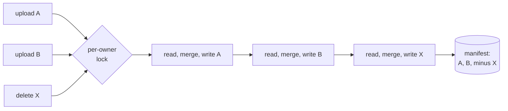

Nucleus is a real production AI assistant I built for a private client. A user uploads their own documents (PDFs, Word files, spreadsheets), then asks business questions and gets answers cited back to the exact file and page. It is multi-tenant: many users, each with their own uploads, sharing one deployment. The engineering that matters most there is not the retrieval or the answer quality. It is the boundary. No user can see, download, retrieve, or overwrite another user's file, and (a subtler one) a filename typed into one chat can never reach into another chat's document.

That boundary is not something you can get from a good system prompt. A prompt is a request, not a wall. Isolation has to live at the data layer, where it holds regardless of what the model does. This piece walks the three mechanisms that build that wall, all from the real storage code: owner-scoped storage, scope-qualified document ids, and a per-owner write lock on the file manifest. The client is not named here; this is mechanism only.

## Layer one: every blob lives under its owner

When a user uploads a file, the route pulls the owner id straight from the authenticated session, never from anything the client sends:

```ts title="src/app/api/ingest/route.ts" {2}
const user = await getCurrentUser();
const ownerId = user.id; // the uploader, straight from the session
```

The original bytes are stored in one bucket, but the object key is prefixed with that owner id. The storage path is literally `<owner_id>/<key>`:

```ts title="src/lib/engine/doc-files.ts"
function storagePath(ownerId: string, docId: string): string {
  return `${ownerId}/${storageKeyFromDocId(docId)}`;
}
```

Retrieval takes the same owner id and rebuilds the same path, so a user can only ever read back a file that sits inside their own folder. The download function's own comment says it plainly: the owner id "scopes the read so a member can only download their OWN upload."

Deletion is where I was most careful, because a delete that escapes its folder is the worst possible bug: it destroys another tenant's data. So the delete path fails closed. Before it removes anything, it asserts that the computed path actually starts with the caller's owner id, and refuses if it does not:

```ts title="src/lib/engine/doc-files.ts (removeOriginalFile)" {3}
// HARD SAFETY: assert the path is strictly inside the caller's folder
if (!path.startsWith(`${ownerId}/`)) {
  console.error(`safety assertion failed - refusing delete`);
  return;
}
```

That check should be structurally impossible to fail, because `storagePath` always prefixes the owner id. It is there anyway. A boundary you care about gets an assertion, not a comment.

:::note{title="Why not rely on the prompt"}
The agentic answer reads the raw uploaded files directly through the model's file tools. If isolation lived only in the instructions to the model, one clever question could try to talk its way across the line. Owner-scoping the storage key and the retrieval means the file another user owns is not even in the set the model can reach. The wall is in the data path, not the wording.
:::

## Layer two: the cross-chat filename steal

Here is the bug that is easy to miss. Inside one user's account, documents are organized by chat. The document id (the storage key and the manifest key) was derived from the filename alone: lowercase it, turn non-alphanumerics into hyphens, and that slug is the id.

Now the same user uploads `report.pdf` in chat A, then uploads a completely different `report.pdf` in chat B. Both filenames slugify to `report`, so both map to the same id, the same storage key, and the same manifest entry. The second upload overwrites the first one's bytes, and the manifest entry gets re-tagged to chat B. Chat A's document silently vanishes. Same owner, but one chat's file reached in and clobbered another chat's file. I tracked this as bug F4.

The fix is to make the id depend on where the file was uploaded, not just what it was named. The upload route always knows the scope: the chat's `session_id`, or a space id for a space-direct upload. It folds that scope into the id by suffixing 12 hex characters of `SHA-256(scope)`:

```ts title="src/lib/engine/ingest.ts (docIdFromFilename)" {6}
// (filename, scope) IS the document identity: same name in the SAME scope
// re-derives the SAME id (replace semantics preserved); same name in ANOTHER
// scope gets a distinct id (both coexist, neither steals the other).
if (!scope) return id;
const scopeTag = createHash("sha256").update(scope, "utf8").digest("hex").slice(0, 12);
return `${id}-${scopeTag}`;
```

So `report.pdf` in chat A and `report.pdf` in chat B now derive two different ids, land on two different storage keys, and get two coexisting manifest entries. Neither one can steal the other. But re-uploading `report.pdf` into the *same* chat still re-derives the *same* id, which preserves the replace-on-reupload behavior that an updated file depends on. The identity is the pair `(filename, scope)`, nothing less.

A few properties I made sure held while doing this:

- **The id stays opaque.** Nothing parses it back into a filename. The manifest carries a `displayName` for the real name, so the suffix never has to be reversed.
- **Old files are untouched.** Callers with no scope (bundled documents, legacy paths) get the historical filename-only id, byte for byte unchanged. Existing production ids keep matching by exact equality.
- **The route always has a scope.** The upload endpoint rejects a request with no `session_id` and no `space_id`, so an id from that path is always scope-qualified.

I proved this against the real storage seam, red-first. The collision test uploads `report.pdf` into chat A and chat B, then reads the manifest back through the real per-chat scoper and asserts both survive, land on different keys, and that chat A's original bytes were not overwritten. Against the unfixed filename-only id, the test fails exactly as the bug predicts. There is also a control that a same-chat re-upload still replaces (one entry, new bytes), so the fix does not break the update path.

## Layer three: no lost writes under concurrency

Each owner's files are indexed by a small manifest, a JSON object at `<owner_id>/_files.json`. Every upload and every delete mutates it by reading the current manifest, merging in the change, and writing the whole thing back. That is a read-modify-write on one object with no compare-and-swap, which is a classic lost-update race.

Picture two uploads for the same user at nearly the same moment (a double-click, two browser tabs, an upload racing a delete). Both read the *old* manifest. Both merge in their own change. Both write back. The second write wins and silently drops the first change. The blob still exists in storage, but the engine only reads the manifest, so the dropped file is invisible. That is bug F5.

The fix is to serialize every manifest mutation per owner through a promise chain, so a mutation only starts after the previous one for that owner has fully committed. Each mutation then reads the latest manifest before it merges:

```ts title="src/lib/engine/doc-files.ts (withManifestLock)" {4}
function withManifestLock<T>(ownerId: string, fn: () => Promise<T>): Promise<T> {
  const prev = manifestLocks.get(ownerId) ?? Promise.resolve();
  // Run fn only after the previous mutation SETTLES - success or failure, so a
  // failed prior write can't wedge the queue for this owner.
  const run = prev.then(() => fn(), () => fn());
  const tail = run.then(() => undefined, () => undefined);
  manifestLocks.set(ownerId, tail);
  void tail.finally(() => {
    if (manifestLocks.get(ownerId) === tail) manifestLocks.delete(ownerId);
  });
  return run;
}
```

Two details make this safe. The chain advances whether the previous mutation succeeded or failed (`prev.then(fn, fn)`), so one failed write cannot wedge every future write for that owner. And the map entry is dropped once the owner's queue drains, so the lock table does not grow without bound. Both the upsert path and the delete path run inside this lock, so an upload racing a delete for the same owner cannot lose either change.



I proved it the same way: an in-memory storage fake that widens the read-modify-write window with a deferred read, then `Promise.all` of two concurrent stores, a store racing a remove, and a three-way store. Each asserts every intended change survives. Without the lock, they lose an entry and go red.

:::warning{title="What the lock does NOT close (stated honestly)"}
This is an in-process lock. It fully closes the realistic same-instance race (parallel-tab uploads land on one instance; a serverless burst for one user is usually one warm instance). It does not close a true cross-instance race, two separate server processes mutating the same owner's manifest at the same moment. No in-memory lock can. I documented that limitation directly in the code, along with the durable fix (move the manifest from a JSON blob into an atomic Postgres table, one row per owner and doc, written under row-level security), and deliberately did not ship that larger migration as an unattended overnight change. A boundary you only half-solved is worth saying so out loud.
:::

## The through-line

Isolation is not one switch. It is owner-scoping on every read and write, an identity for each document that includes where it lives so names cannot collide across chats, and serialized writes so a concurrent mutation cannot drop a file on the floor. Each layer is small. Each is grounded in a real bug (a silent overwrite, a lost update) with a red-first test that fails when the fix is reverted. And where a layer only covers the realistic case, the code says exactly what it does not cover instead of implying it is airtight. That last habit, [naming what you did not verify](/notes/honest-automation), is the same discipline I hold everywhere in the fleet.
