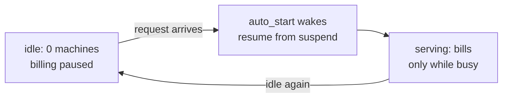

Nucleus is a real production AI assistant I built for a private client. Users upload their own documents and data, then ask business questions and get answers cited back to the source. It is multi-tenant and it is genuinely in production, but it is not a high-traffic app. A handful of people use it, in bursts, and then nobody touches it for hours. An app with that shape has a cost problem that has nothing to do with the model: a server that runs all day to answer for a few minutes is paying rent on empty rooms.

This piece is about making a low-traffic production AI app cost close to nothing while it is idle, without a cold start that makes the first request feel broken. Two mechanisms do it. The first is infrastructure: the app is off by default and wakes on request, so it bills only while it is actually serving. The second is measurement: a per-call cost meter that prices real token usage per model, so what the app spends is measured, not guessed. The client is not named here; this is mechanism only.

## Off by default, awake on request

The engine runs on Fly.io. The default way to run a service there is to keep at least one machine warm at all times, so every request is answered immediately. That is the right call for something with steady traffic. For this app it means paying for a machine 24 hours a day to serve for a few minutes of it. The alternative is to let the machine turn off when nothing is happening and turn back on when a request arrives. Three settings do that, and they live in the Fly config:

```toml title="fly.toml (http_service)"
auto_stop_machines = "suspend"
auto_start_machines = true
min_machines_running = 0
```

`min_machines_running = 0` is the switch that ends "always warm." It tells Fly it is allowed to have zero machines running when there is no traffic. `auto_start_machines = true` is what makes that safe: when a request comes in and no machine is up, Fly starts one to serve it, automatically, before the request is handled. And `auto_stop_machines = "suspend"` decides *how* the machine goes away when it is idle.

That last value is the one that matters most for the user experience, so it is worth being precise. There are two ways to turn a machine off. `stop` shuts it down cold: the next request has to boot the whole thing from scratch, which is a real cold start. `suspend` freezes the running machine and keeps its memory snapshot, then thaws it on the next request. Resume from suspend is much faster than a cold boot because the process is already initialized. The result is that after a long idle, the first request pays a small wake latency, a beat longer than usual, and every request after it is normal speed. That is the whole trade, stated honestly: you give up instant response on the very first request after idle, and in exchange the app bills only while it is actually serving.



:::note{title="Why suspend, not stop"}
Scale-to-zero is only usable if the wake is fast enough that a user does not think the app is down. `stop` gives the cheapest idle state but the slowest wake (a full cold boot of the Next.js server plus the agent runtime). `suspend` keeps the machine's memory image, so resume skips the boot and the first request after idle feels like a brief pause, not a failure. The choice between them is the whole difference between "scale-to-zero is a nice cost win" and "scale-to-zero made the demo feel broken."
:::

There is a subtlety worth naming: this app runs the Next.js standalone server together with a model-agent subprocess, so its warm state is not trivial to rebuild. That is exactly the case where `suspend` earns its keep over `stop`. Keeping the initialized process image around means the wake does not have to re-do that startup work every time someone shows up after a quiet stretch.

The concurrency limits stay configured either way, so a real burst (several people asking at once) still fans out onto enough capacity. Scale-to-zero is not "one request at a time." It is "zero machines when nobody is here, and however many are needed when they are."

## Measure the cost, do not estimate it

Turning the machine off handles the infrastructure bill. It does nothing about the other cost of an AI app: the model calls. Those are billed per token, and for a while the app *reported* that cost with a number that was quietly wrong.

The answer inspector (the panel that shows how an answer was produced) included a cost line. Under the hood it computed that cost by hardcoding one model's per-token rates and labeling every call as the cheap model, even on turns where a more expensive model actually answered. Two bugs in one: the hardcoded rates were stale, and the model label was fixed regardless of which model ran. On any turn where the expensive model answered, the reported cost was several times too low. A cost line that is wrong in the cheap direction is worse than no cost line, because you trust it and build a spend ledger on top of it, and the ledger inherits the lie.

The fix is to price each call by the model that actually resolved for it. The inspector now carries the resolved model through to the cost step and looks its price up in a per-model table, rather than assuming one rate for everything:

```ts title="src/lib/engine/answer-agentic.ts (model-aware pricing)" {2,4,6}
// Price by the RESOLVED model that answered, not a flat assumption.
const resolvedModel = opts.model ?? DEFAULT_MODEL;
const isLocal = resolvedModel.startsWith("local:");
// Per-model price table (rates omitted here); local models cost nothing on the API.
const price = isLocal ? ZERO : (PRICES_PER_1M[resolvedModel] ?? FALLBACK);
const usd = (opts.inputTokens / 1_000_000) * price.in
          + (opts.outputTokens / 1_000_000) * price.out;
```

Three properties of that make the number trustworthy instead of decorative. It is keyed on the model that answered, so a call on the expensive model is priced at the expensive model's rate. A model whose price is not in the table is flagged as unknown in the note rather than silently priced at the wrong rate. And a local model (the [local mode](/notes/nucleus-local-mode) that runs on the user's own hardware) prices at zero, because it touches no paid API. Every path that answers now feeds its resolved model into this same cost step, so the messages engine, the agentic engine, and the local engine all report a cost consistent with what actually ran.

I kept one habit from the older cost code because it was the right one: never invent a dollar figure. When there is no live model call, or a provider does not report token counts, or a model's price is not tracked, the report says so and leaves the cost unknown, rather than printing a made-up number.

```ts title="src/lib/engine/answer.ts (buildCost, honest by construction)" {3,5}
if (liveCalls === 0) {
  pricingNote = "No live LLM call this turn.";
} else if (promptTokens === undefined) {
  pricingNote = `Provider did not report token usage; tokens shown as n/a.`;
} else if (!price) {
  pricingNote = `Token pricing not tracked for this model.`;
} else {
  // real tokens times the real per-model rate gives a measured cost
}
```

:::tip{title="An honest cost line refuses to guess"}
The dangerous version of a cost meter is one that always shows a confident number. If the provider did not report usage, or the model's rate is not known, the truthful output is "unknown, and here is why," not a plausible-looking dollar amount. A number you trust that is quietly wrong does more damage than a blank that tells you it is blank. So the report is null-with-a-reason wherever it cannot measure, and a real figure only where it can.
:::

## A measured usage row per call

Pricing a single answer correctly is the building block. The point of getting it right is to be able to add it up. So the app's end-to-end lifecycle test appends one USAGE row per model call to a running ledger, built from the response's own cost block, so the ledger accumulates measured spend instead of flat per-call estimates:

```js title="tests/journeys/lifecycle.mjs (logUsage)" {4,6,8}
function logUsage(label, askJson) {
  try {
    const c = askJson?.inspector?.cost;
    if (!c) return; // engine error / no inspector, nothing measured to log
    const row =
      `| USAGE-${label} | ${date} | measured | ${c.model} | ` +
      `in=${c.promptTokens} out=${c.completionTokens} | ${c.usd} |\n`;
    appendUsageRow(row);
  } catch { /* a ledger row is best-effort; it must never fail a check */ }
}
```

Each row records the same things the fixed inspector computes: the model that answered, the actual input and output token counts for that call, and the cost the price table derived from them. Because the row is built from `inspector.cost`, and that block is now model-aware, the ledger tracks what really happened. A call on the expensive model logs the expensive model and its real cost; a local call logs zero. The row is written defensively: it is best-effort, wrapped so a logging failure can never turn a passing run red. Measuring cost is a side benefit of the test, not something the test is allowed to break on.

There is a design choice in where the number comes from. The token counts are the provider's *reported* usage for that call, not an estimate from counting characters. The cost is those reported tokens multiplied by the resolved model's rate. So the only place a guess could enter (the per-token price) is a small, auditable table, and everything else is measurement. That is the difference between a ledger you can reconcile and a ledger you can only hope is right.

## The through-line

Making a low-traffic production AI app cheap at rest is two problems, and they are different in kind. One is infrastructure: do not pay for a machine while nobody is using it. Suspend when idle, resume on request, and accept a slightly slower first wake as the honest price of an idle bill of nothing. The other is accounting: know what the model calls actually cost. Price each call by the model that answered, log a measured row per call, and refuse to print a number you cannot measure. Neither mechanism is large. Together they turn "the demo probably costs a bit, I think" into "the app is off unless someone is using it, and here is the measured spend when they are."

Both halves are the same discipline I hold across the fleet: make the real behavior structural (the machine genuinely stops; the price genuinely follows the model), and where a value is not measured, say so instead of guessing. That is the honest-automation habit of [naming what you did not verify, and never claiming an effect you cannot see](/notes/honest-automation). It sits next to the other cost-and-keys mechanisms in Nucleus: who pays, in [bring-your-own API keys](/notes/nucleus-byo-keys), and where the data goes, in [local mode](/notes/nucleus-local-mode).
