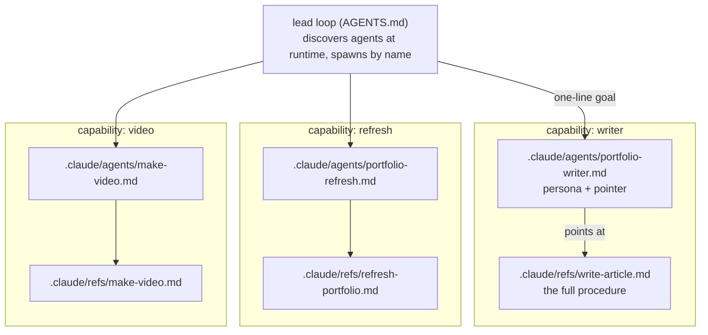
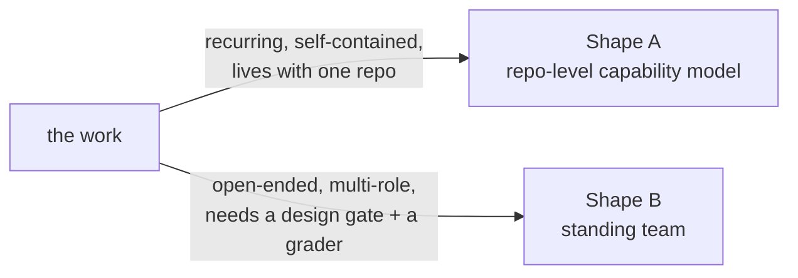

I run agents in two packagings, and the choice between them is not about taste. It is about the shape of the work. One is a **repo-level capability model**: agents that live inside a single codebase as small files, each owning one repeatable job, discovered and spawned by a thin lead loop. The other is a **standing team**: a PM, an engineer, and an independent verifier I convene for open-ended build work that needs a design gate and a grader who did not write the code. Both run the same spine (a long-lived orchestrator holds the plan and delegates the heavy work to bounded subagents), which is the subject of [my agent teams](/notes/my-agent-teams) and [bounded context, unbounded work](/notes/context-engineering). This piece is about the container, not the spine: what each packaging is made of, and when each one fits.

## Shape A: the repo-level capability model

This portfolio site is maintained by shape A, so I can show you the actual files.

A capability here is a **two-file unit**. The first file is a Claude Code subagent definition at `.claude/agents/<name>.md`: a few lines of YAML frontmatter (a `name`, a `description` of when to use it, the tools it may touch) and a short body that is a persona plus a single pointer. The body does not contain the procedure. It says, in effect, this is who you are, now go read your how-to. The `portfolio-writer` definition is representative:

```md title=".claude/agents/portfolio-writer.md"
You write or refresh ONE portfolio article on how the owner's agent
systems actually work. ...

**Read and follow `.claude/refs/write-article.md` exactly.**
That ref is your full how-to.
```

The second file is the how-to: `.claude/refs/<name>.md`. That is where the depth lives, as a flat, self-contained, numbered procedure a worker can follow end to end. `write-article.md` is a step-0-through-step-6 recipe (read the ledger, gather real source, draft, fill the key takes, clear the honesty gate, build, update the ledger, report). The definition carries the pointer; the ref carries the content.

Why split a capability across two files at all? Because the two halves change for different reasons and are read by different readers. The definition is what the lead sees when it decides who to spawn, so it stays short and stable. The ref is what the worker loads once it is running, so it can be long and can churn as the procedure sharpens. Keeping them apart means editing the procedure never touches the spawn surface, and a worker never has the whole how-to jammed into the prompt that summons it.



The lead is thin on purpose. It lives in `AGENTS.md` as a loop that reads three small ledger files, decides there is one real job to do, and spawns a single worker by name with a one-line intent (not the how-to, which the worker loads itself). Crucially, it **discovers the available agents at runtime** rather than hardcoding them: the loop's first step is a literal `ls .claude/agents/*.md`. So the set of capabilities is data the loop reads, not logic baked into it.

That runtime discovery is what makes growth cheap. This repo currently ships three capabilities, each a def-plus-ref pair:

- **`portfolio-writer`** writes or refreshes one article per run (it wrote this one).
- **`portfolio-refresh`** scans the owner's projects for real changes and syncs them into the site.
- **`make-video`** renders one walkthrough MP4 offline from a screenshot spec.

Adding a fourth is not a code change to the orchestrator. You write the ref (the procedure), write the definition (the persona and the pointer), and the next loop run picks it up because it globs the directory. I call this the **capability ratchet**: the system grows by accretion of small, self-contained units, and each unit is a reviewable pair of markdown files.

:::tip{title="The property that makes shape A worth it"}
The capabilities are versioned with the code they maintain. Clone the repo and the agents come with it, pinned to the same commit as the site they operate on. A change to how the writer behaves is a diff on `write-article.md`, reviewed like any other change. The agent system is not configuration living in some external console; it is source, in the tree, under the same history as everything it touches.
:::

There is one constraint shape A leans on, and it is load-bearing rather than incidental: a worker subagent cannot spawn another subagent. So when the writer decides an article would be stronger with a video, it does not spawn `make-video` (it cannot). It writes a small request into a queue and reports, and the long-lived lead fulfills that request on a later turn. That request-do-not-spawn handoff is covered in [bounded context, unbounded work](/notes/context-engineering); here the point is narrower. It is why the fleet stays a flat set of leaves under one thin lead instead of a tree of agents spawning agents.

## Shape B: the standing team

Shape B is a different container for the same spine. Instead of a set of one-job capabilities embedded in a repo, it is a small **standing team of roles** I convene for a build: a PM, an engineer, and a verifier, defined once at the user level (`~/.claude/agents/`) and available to any project. They are not a repeatable procedure. They are participants in a process, with memory and peer handoffs.

The roles split by responsibility, and the split is the design:

- The **PM** owns what and why, and the golden bar: a real, non-toy reference the build is measured against. Its first move is a **design-approval gate**. No implementation begins until a short written design is approved by a human, and a prior approval never carries over to a new piece of work. That gate exists because the most expensive failure is building the wrong thing well.
- The **engineer** builds to the approved scope, writes the docs, and writes the tests.
- The **verifier** grades the result independently and is **read-only on the source: it did not write the code it checks.** Its pass-or-fail verdict alone decides ship or bounce-back. It owns the coverage design too, deriving the test scenarios from the real artifacts rather than from the code that was written.

The independence is not a nicety layered on top. It is the reason to pay for a team at all. An author is the worst grader of their own work, because they test the path they built rather than the outcome the user needs. A separate verifier that never saw the implementation catches the looks-done-but-does-nothing failure that a self-graded suite sails straight past. That argument, and the production bug that taught it, is [independent verification](/notes/independent-verification).

So shape B buys two things shape A does not have built in: a **human design gate** before any code, and an **independent grader** after it. Those are exactly what open-ended, multi-role build work needs and what a single repeatable capability does not.

## Same spine, different container

Strip away the packaging and both shapes are the same three moves I keep coming back to: a long-lived orchestrator holds the plan and delegates; every stochastic step is wrapped in a deterministic gate; a miss edits the program, not the output. That is [orchestrate, gate, ratchet](/notes/orchestrate-gate-ratchet), and it runs underneath both containers unchanged. The lead in shape A that reads a ledger and spawns a writer, and the lead in shape B that convenes a PM and holds the verifier's verdict as the ship decision, are the same orchestrator move at two altitudes.

What differs is the container, and the container is chosen by the work:



## When each one fits

**Reach for the repo-level capability model when the job is a recurring, self-contained procedure that belongs to one codebase.** Write an article. Refresh a site from its source projects. Render a walkthrough video. Each of those is a repeatable unit of work with a knowable procedure, tightly coupled to one repo's structure and gates, run over and over on a loop. Packaging it as a def-plus-ref pair puts the capability in the tree next to the thing it maintains, versions it with that thing, and lets the system grow one small reviewable pair at a time. This is the right shape for the fleet: an agent per repo, each maintaining its own project.

**Reach for the standing team when the work is open-ended, spans multiple roles, and needs a design gate and independent verification.** Building or changing a real feature is not a repeatable procedure with a fixed how-to. It needs someone to decide what complete means and get a human to approve it before any code, someone to build, and someone who did not build it to prove it works against a bar derived from the real data. That is three distinct responsibilities held apart on purpose, and holding them apart is the whole value.

The honest tradeoffs, stated plainly:

- **Shape A is cheap to grow and cheap to run, but it assumes the procedure is knowable in advance.** A capability is a how-to you can write down. When the job is a one-off design problem with no fixed recipe, there is no ref to write, and forcing it into one produces a brittle script that breaks on the first case it did not anticipate.
- **Shape B carries real overhead: three roles, a human approval gate, a full verification pass.** That is deliberate weight, and it is wasted on a small repeatable job. Convening a PM and an independent verifier to write one article would be pure ceremony. The design gate that protects a feature build is friction with no payoff when the work is a procedure you already trust.
- **They are not exclusive, and the boundary is not sharp.** A repo-level capability whose procedure keeps failing in new ways is a signal the work is more open-ended than a single ref can hold, and might want to be built (or rebuilt) under the team. A build the team ships and then has to maintain forever might be worth packaging as a repo-level capability once its procedure stabilizes. The question to keep asking is the same one: is this a repeatable procedure that lives with a codebase, or open-ended build work that needs a gate and a grader? Answer that honestly and the packaging picks itself.

Two containers, one spine. The spine is why they work. The container is a decision about the shape of the work, and getting it right is most of the value.
