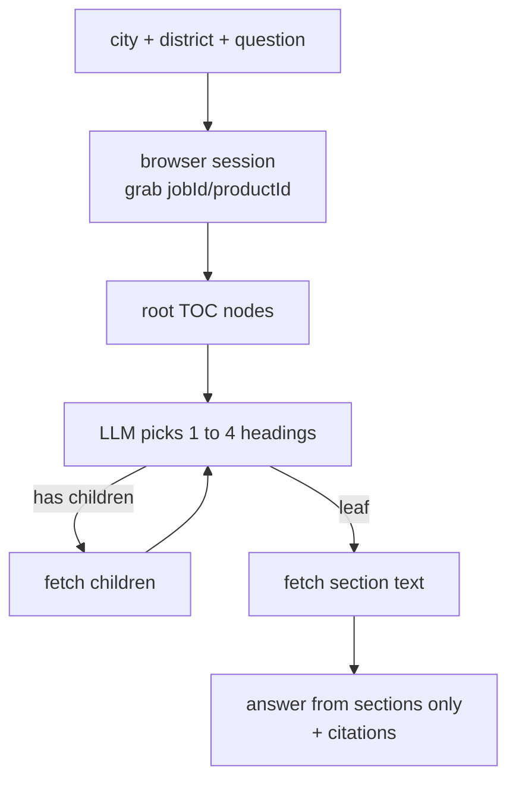

These are things I tried to start. Early-venture experiments, mostly built solo on weekends, none of them a company yet. I am writing them up because the code is real and the ideas held up, not because any of them shipped revenue. The one that got furthest is a zoning copilot, so I will spend most of the space there and be honest about how thin the other three are.

## Zoning copilot: answer a permitting question from the live code

The premise: you are looking at a lot in some California city and you want to know whether you can build a duplex on it. The answer is in the city's zoning code, which lives on Municode, which is a giant nested table of contents that nobody enjoys clicking through. I wanted a tool that takes a city, an optional zoning district, and a plain question, then does the clicking for you and answers from the actual code text with section citations.


*The whole run, on one screen: ask on top, watch the model walk the table of contents on the left, read the cited answer on the right.*

The interesting decision is that there is no vector database. Most RAG systems pre-index a corpus: chunk it, embed it, store the vectors, search at query time. I did not index California's zoning codes. Instead the system opens the live Municode site for the requested city and walks an LLM down the table of contents in real time.



### The crawler borrows the browser's own session

Municode is a single-page app backed by a JSON API, and that API wants the right `jobId` and `productId` plus a logged-in session. Rather than reverse-engineer the auth, the crawler launches a headless Chromium with Playwright, loads the city page, and listens for the site's own `codesToc` request going by so it can read the two IDs straight off the URL.

```python title="crawler.py" {6-11}
async def on_request(req):
    if "codesToc" in req.url and "breadcrumb" not in req.url and not api_params:
        import re
        job_match = re.search(r"jobId=(\d+)", req.url)
        prod_match = re.search(r"productId=(\d+)", req.url)
        if job_match and prod_match:
            api_params["job_id"] = job_match.group(1)
            api_params["product_id"] = prod_match.group(1)
```

From then on, every TOC drill-down is a `fetch()` run *inside* that browser page, with `credentials: 'include'`. The page is already authenticated, so the API calls just work. No token handling, no scraping-ban arms race. The browser is doing the boring part for me.

:::tip{title="Why run fetch from inside the page"}
Calling the Municode API directly from Python means rebuilding its cookies and headers by hand. Calling it from `page.evaluate(...)` means the request rides the session the SPA already established. It is the same trick, just pointed at a TOC API instead of a login form.
:::

### The LLM is the navigator, not the answer

At each level of the tree, the system hands the model a numbered list of headings and asks it to pick the 1 to 4 most likely to contain the answer. The system prompt is short and bossy on purpose:

```text title="navigator.py (pick prompt)"
You are a zoning code navigation expert.
Given a numbered list of municipal code sections or articles, select the ones
most likely to contain the answer to the zoning question.

Rules:
- Select 1 to 4 items maximum.
- Prefer the most specific match (a specific district section over a whole chapter).
- If a zoning district is given, always include its specific section.
- Return ONLY valid JSON with no markdown.
```

If a picked node has children, the navigator fetches them and recurses, up to a depth cap of six. If it is a leaf, the crawler opens it and pulls the section text out of the DOM (with a small filter to drop UI chrome like "PRINT SECTION"). The recursion returns a flat list of `(text, heading, url)` triples, deduped on the first 200 characters so two paths to the same section do not double-count.

The whole navigation streams to the frontend over Server-Sent Events. The Next.js client shows colored cards per depth: candidates considered, headings picked, children fetched, content pulled. You watch the model reason its way down the tree instead of staring at a spinner. That was the part that made the demo feel alive.

### The answer has to cite

Once the sections are gathered, a separate generator writes the answer, and it is told flatly that its own training knowledge does not count.

```text title="answerer.py (answer prompt)"
CRITICAL RULES:
1. Answer ONLY from the provided code sections. Do not use general knowledge.
2. Quote section IDs exactly as they appear in the source text.
3. If the code is ambiguous or incomplete, say so explicitly.
4. Never speculate about permit procedures, fees, or environmental review.
5. Return ONLY valid JSON.
```

It returns a structured `ZoningAnswer`: a 2 to 4 sentence answer, an `allowed` field that is one of `likely / unclear / not allowed / n/a`, the key rules with citations, and the section IDs it used. The pipeline then auto-appends every fetched section ID to the citations, so the answer can always be traced back to the code it read. If the navigator finds nothing usable, the pipeline raises instead of letting the model improvise. Same instinct I kept landing on elsewhere: ground the answer or refuse it.

:::note{title="The path I built but did not ship"}
There is a `planner.py` and a `rag.py` in the repo: a keyword pre-filter over the TOC, an LLM section planner, subsection-aware chunking, and an optional embeddings retrieval step that only kicks in past a token threshold. That was the indexed approach. The live pipeline does not call it. I built both and shipped the live-navigation one because it was simpler, needed no stored index per city, and the code stayed small enough to read top to bottom. The indexing code is still there as the road not taken.
:::

The stack is small on purpose: FastAPI with a streaming endpoint, Playwright for the browser, the OpenAI API for the two LLM steps, a Next.js frontend with shadcn cards, sixteen California cities wired in by Municode URL. It is the kind of thing one person can hold in their head, which was the point.

## The other three, honestly

The zoning copilot is the only one of these that is a running system. The rest are earlier, thinner, and I would rather say that plainly than dress them up.

**AppraisalOS** is a design, not a build. It is a technical design document for a compliance-sensitive, human-in-the-loop operating system for a real-estate appraisal business: a single-source-of-truth data model (jobs, leads, contacts, communications log, audit and errors) plus a set of n8n workflows for lead intake, enrichment, human-approved outreach, and intake auto-response. The design is careful about the right things. Every automated action logs to an audit table, outreach drafts wait for human approval before sending, and there are explicit guards like "do not infer missing data" and "treat unavailable evidence as zero score." But it is a blueprint. There is no shipped code behind it, and I am not going to pretend otherwise.

**The n8n folder** is the thinnest of all: a handful of screenshots of automation workflows, with no exportable definitions next to them. Worth a mention as part of the same automation thread, not worth a write-up of its own.

**The WordPress/SEO one** is more real than AppraisalOS in that it actually runs. It is a content-automation pipeline for a Chinese-language poker news site, built as a 29-node n8n workflow. It reads a PokerNews RSS feed, deduplicates against a Google Sheet so it never reposts, runs the article through OpenAI to translate and restructure it into Chinese, generates a category and tags, then sends the title and body to Telegram and waits. Only after someone taps approve does it create a WordPress draft. The guardrails are sensible for an automated publisher: a keyword list that keeps brand names like "PokerNews" and "WSOP" untranslated, URL-based deduplication, and a human in the loop at the moment of publish.

## What they have in common

I did not plan a theme across these. It showed up anyway. In every one, the LLM or the automation proposes, and a human or a hard rule disposes. The zoning copilot retrieves live and refuses to answer without a cited section. The WordPress pipeline drafts behind a Telegram approve/reject gate. The appraisal design routes every outbound message through human approval and logs everything. None of these trusts the model to be the final authority, which is the same shape as the [agentic systems I kept building afterward](/notes/orchestrate-gate-ratchet). These were the experiments where I worked that instinct out, on small problems, before it became the way I build.
