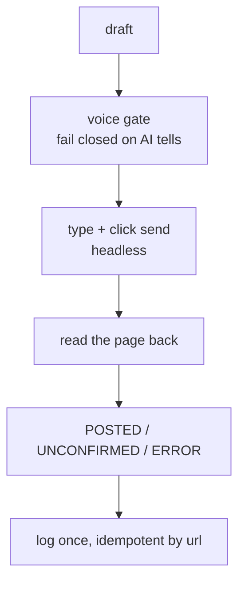

I wanted an agent that could run a real X account without ever sounding like an agent. Not a scheduler that fires generic threads, but something that finds a post worth replying to, writes a reply that reads like a dry person typing between two builds, posts it headless from a Linux box, and then tells me the truth about whether it actually went out. That is `x-agent`, and it is one of the real unsupervised workers in my [agent fleet](/notes/my-agent-teams). It runs the same [orchestrate, gate, ratchet](/notes/orchestrate-gate-ratchet) shape as the rest: a lead session holds the timing and delegates each post to a throwaway subagent that does the work in its own context.

Two skills cover the two jobs. One writes replies to other people's posts. One writes original posts grounded in my own beliefs. Both share a voice, both share the posting machinery, and both refuse to post anything they cannot verify went out.

## Why it seeds cookies instead of logging in

X blocks headless logins. Try to sign in from an automated browser and you hit an SMS or phone-verification wall, every time. So the agent never logs in. It takes an existing authenticated cookie session and injects it into a Playwright `storageState` once per session, then runs everything headless against that saved state.

```
x-cookies.json  (auth_token + ct0, the seed)  --seed-->  x-state.json
                                                          (the storageState Playwright reuses)
```

After that one seed step, fetching tweets, posting, and reading the result back all run with no login and no visible browser. The session files live in a gitignored runtime folder, because the auth cookies are full account access.

:::warning{title="Auth is never content"}
The cookies are the keys to the account. They stay out of the repo, out of every log, and out of anything that gets published. The same line applies to the account handle and to any personal post: this write-up describes the mechanism, never the credentials.
:::

## The voice gate: a draft that sounds like a model cannot post

The whole reason this account exists is that most automated posting reads like a chatbot doing thought leadership. So the single most important piece is the voice gate, and it is not a vibe. It is a deterministic validator with every rule encoded as a regex or a word-list, and it exits non-zero the moment it finds an AI shape-tell.

```python title="tweet_composer.py (rules as data, it bites)" {3-5}
EM_DASH = [
    ("em dash (—)", re.compile(r"—")),
    ("en dash as em dash (–)", re.compile(r"–")),
    ("spaced double-hyphen ( -- )", re.compile(r"\s--\s")),
]
```

It catches the loud fingerprints (the em-dash, bold, markdown lists), the blacklist vocabulary (leverage, robust, nuanced, the landscape and tapestry words), significance inflation ("this represents a shift"), parallel triplets, and infomercial hooks. There is even a rule for arrow glyphs, because a draft seeded from a diagram-heavy source can leak an `A to B` flowchart arrow that reads as machine-generated. A draft that trips any rule does not get posted. It gets rewritten until the gate exits clean.

:::tip{title="The same floor, both directions"}
This is the exact gate this portfolio's writing now mirrors. The no-em-dash, no-AI-tells rule I hold these articles to is lifted straight from this skill's voice doc, because the two surfaces share a reader who can smell a model a mile off.
:::

The gate is a tripwire for shape, not a judge of whether the joke lands. So on top of it sits a human self-check from the voice doc: say the line out loud, does it read like a bit a dry friend would type, or like a keynote. The script kills the AI clothes; the writer still has to make it funny.

## Two channels, one honest status: never claim a post you can't see

A success banner is the page talking. It is not proof. So after the post script types the approved text and clicks send, it reads the result back before it believes anything.



It looks for the real "your post was sent" confirmation and, as a backstop, checks that the compose box actually cleared. Only then does it go find the new tweet's permalink on the profile. That permalink read is itself defensive: X's timeline intermittently renders a "Something went wrong" page that returns zero tweets, which would silently log a real post with a null URL. So the capture retries across a few attempts and alternates between two profile views, so one flaky render can't lose a permalink that exists.

The status it prints is honest about what it could confirm. `POSTED` with a permalink means it saw the tweet. `UNCONFIRMED` means the send may have gone through but the read-back didn't catch it, so it says so and points at the screenshot. `ERROR` means it broke. The agent never upgrades a status it could not verify. This is the same discipline the [jobright agent](/notes/jobright-agent) uses on its two-channel verification: read the result back, and if you can't see it, don't claim it.

## The privacy gate on original posts

Replies bounce off a public tweet, so they need the voice gate and nothing more. Original posts are different: they are grounded in my private life-wiki, and a public post can never leak something personal. So an original post runs a much heavier stack before a human ever sees it.

First a default-deny candidate sweep. A wiki page is non-shareable until it positively proves it is a safe builder or craft take. Anything in the sensitive clusters, and anything missing the safety metadata, falls straight through to denied. Then a deterministic, fail-closed scanner runs on the source page and on the draft: it blocks real names, @handles, employers, dollar amounts (including spelled-out ones like "two grand"), exact dates, and any draft whose source traces to a private page. If the protective name set fails to load, it exits with an error rather than passing clean. That is what fail-closed means here: the unsafe default is to stop, not to ship.

The scanner is regex, so it cannot read meaning. A paraphrased disclosure ("the guy who took first author", "my research group") sails past it. So the last machine layer is a mandatory meaning-layer self-check where the model classifies the draft against five specific disclosures and writes the pass or fail out in the open. And then a human approves it. No layer is treated as a guarantee. The four stacked, plus a person saying go, are the floor.

## The seam back to this site

The account does not only consume other people's posts. It consumes mine. Every article I publish here carries a short set of key takes in its frontmatter, and the original-post skill reads those as seeds: it pulls a published take, lands the article's actual argument as a deadpan bit, and posts it. A small sweep keeps a queue of unspent seeds and dedups against what already went out, so a take is posted exactly once.

So the loop closes on itself. I write an honest article about how one of these agents works. The writing clears the same de-AI voice floor the agent enforces on its tweets. Then the agent turns the article's key takes into posts, in the same voice, on a real account, and logs only what it can actually see. The voice is the product, and both ends of it run through the same gate.
